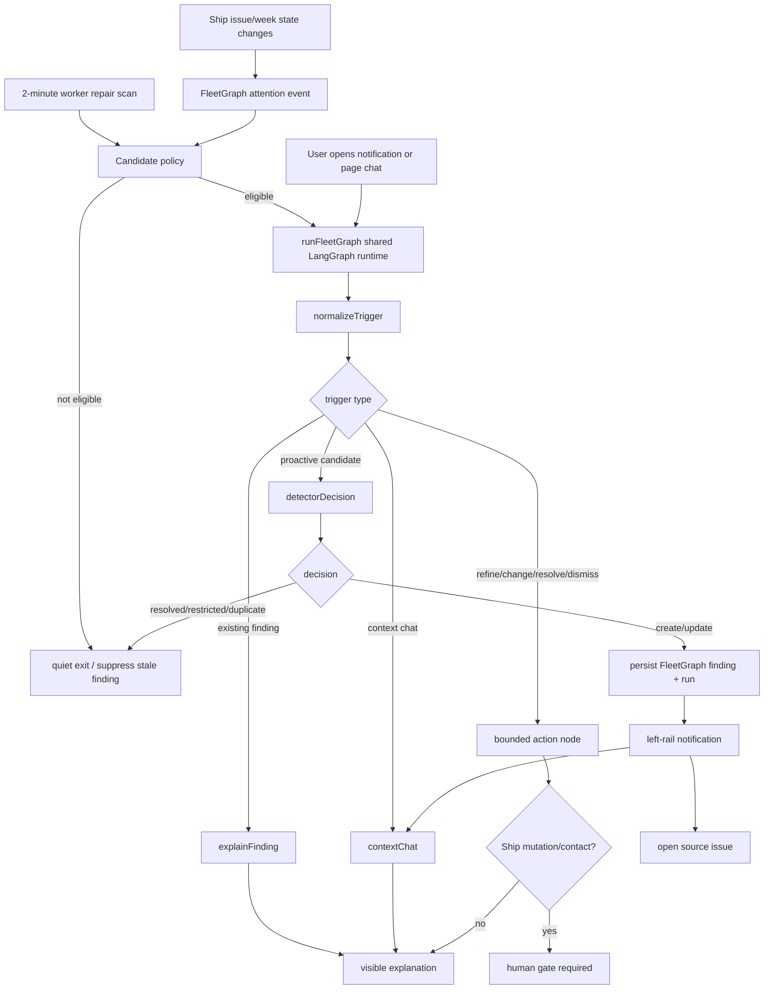

# Agent Responsibility

FleetGraph is Ship's project intelligence and attention engine. It watches real Ship work state, decides when a project condition deserves attention, routes the finding to the smallest useful audience, and gives the user a context-aware explanation path.

What it monitors proactively:

| Signal | Source state | Surfaced when |
| --- | --- | --- |
| Blocked | Issue `state = blocked` | Any visible active issue is blocked, including missing blocker text |
| Stale | Issue `state = in_progress` or `in_review` with no meaningful update for 180+ days | Work appears abandoned but is not done/cancelled/blocked |
| At risk | High/urgent current-week work | The issue has no assignee or is within 3 days of sprint end |

What it reasons about on demand:

- Why a selected notification or source issue was flagged.
- What evidence is visible to the current user.
- What next action is useful without pretending work was changed.
- Whether a user request is supported by the current context capsule.

What it can do autonomously:

- Read permitted Ship state.
- Claim FleetGraph attention events.
- Run deterministic candidate policy before graph execution.
- Create/update/suppress/resolve FleetGraph-owned findings.
- Persist FleetGraph runs, evidence snapshots, trace metadata, and notification read state.
- Surface in-app notifications and context chat answers.

What always requires a human:

- Mutating Ship source records: status, owner, priority, sprint/week, title, content, due date.
- Contacting another person or posting a comment/message.
- Escalating to a director or accepting delivery risk on behalf of the team.

Who it notifies:

- Issue assignee or owner first.
- Project owner/PM when execution ownership is missing or the action is project-level.
- Program/workspace admin only as fallback for orphaned or escalated work.
- Visibility wins over routing: user-facing output is filtered before display and restricted evidence becomes no-safe-output, not a leak.

How on-demand mode uses current view:

- The chat request carries a bounded context capsule: issue/document/sprint/project/program/workspace identifiers plus any selected notification/finding.
- The active page context is the anchor; notification context can add source evidence.
- The same `runFleetGraph` graph boundary handles proactive and on-demand paths. The trigger differs; the graph runtime does not fork into separate products.

# Graph Diagram

Primary runtime boundary: `api/src/fleetgraph/core.ts`. Proactive execution enters through `api/src/fleetgraph/execution/worker.ts`. User-facing routes enter through `api/src/routes/fleetgraph.ts`.

# Use Cases

| # | Role | Trigger | Agent detects / produces | Human decides |
| ---: | --- | --- | --- | --- |
| 1 | PM | Issue becomes blocked | Notification, source issue, blocker reason or missing-reason gap, owner/assignee, next unblock step | Ask owner, edit/send message, move work, or accept risk |
| 2 | Engineer | Opens contextual chat from a blocked issue/finding | Explanation of why it was flagged, visible evidence, and next step | Follow up, ask deeper question, or update the issue manually |
| 3 | PM | Active work has no meaningful update for 180+ days | Stale-work attention signal with source and suggested review action | Revive, close, reassign, or defer the work |
| 4 | PM/Director | High/urgent current-week issue lacks owner or nears sprint end | At-risk signal with sprint context and likely accountable audience | Assign owner, re-scope, escalate, or accept carryover |
| 5 | Reviewer/Admin | Needs proof that the agent is a graph, not a pipeline | Distinct proactive, on-demand, quiet, and human-gated trace paths | Inspect trace links and run/eval evidence |

# Trigger Model

FleetGraph uses a hybrid trigger model:

- Event path: issue mutations enqueue durable `fleetgraph_attention_events`; the worker claims pending events and evaluates only changed sources.
- Repair path: a 2-minute server-side worker scan catches missed events and revalidates open findings.
- Test path: `POST /api/fleetgraph/test/worker-tick` is available only in `NODE_ENV=test` and admin-gated for deterministic E2E proof.

Tradeoffs:

| Choice | Why |
| --- | --- |
| Events first | Fast detection without full-workspace graph runs |
| Repair scan | Prevents silent misses if enqueue/processing fails |
| SQL policy before graph | Keeps most worker ticks zero-token and low-cost |
| API-process worker with DB leases | Simple deployment; avoids duplicate scans across instances |

Latency defense:

- Worker interval default: 120,000 ms.
- Timed E2E path asserts mutation-created event processing under 30 seconds when the test worker trigger is invoked.
- Production target remains under 5 minutes: event claim or next 2-minute repair scan, bounded context fetch, graph run, persisted finding, notification visible.

# Test Cases

| # | Ship state | Expected output | Evidence |
| ---: | --- | --- | --- |
| 1 | Issue has `state = blocked` and blocker text | Proactive `create_finding`, notification visible, no Ship mutation claim | LangSmith proactive create: https://smith.langchain.com/public/ad258212-2b31-4c36-88f2-ad91401a7d86/r |
| 2 | User asks from existing finding context | On-demand `explain` path returns visible evidence and next action | LangSmith explain: https://smith.langchain.com/public/2cccea43-ab44-4228-9f04-5f4b331aed3a/r |
| 3 | No eligible candidate or unsupported safe output | Quiet exit, zero model calls, no finding created | Run report: `my-docs/evals/fleetgraph-observability/run-2026-05-28T22-44-44-783Z.md` |
| 4 | Chat asks for next action on blocked source | Human gate required; issue remains blocked after chat | `e2e/fleetgraph-attention-loop.spec.ts` |
| 5 | Current product copy from authored and runtime cases | 6 pass, 0 fail; no reviewer-proof scaffolding in UI copy | `my-docs/evals/fleetgraph-product-surface/latest.md` |

Latest observability run: `my-docs/evals/fleetgraph-observability/run-2026-05-28T22-44-44-783Z.md`.

- Traces: 4.
- Model calls: 1.
- Total tokens: 180.
- Estimated cost: `$0.0000675`.
- Score pass/fail: 32/0.
- Langfuse trace coverage: 4/4.
- LangSmith trace coverage: 4/4.
- Two non-primary share attempts returned provider 404s; proactive create and explain have public LangSmith links and are the primary reviewer traces.

# Architecture Decisions

| Decision | Implementation | Defense |
| --- | --- | --- |
| One graph boundary | `runFleetGraph` in `api/src/fleetgraph/core.ts` compiles a shared LangGraph `StateGraph` | Proactive and on-demand modes branch inside one runtime |
| Deterministic detection first | `api/src/fleetgraph/detection/attention-policy.ts` maps Ship issue context to `blocked`, `stale`, or `at_risk` | Avoids spending model tokens on broad scans |
| FleetGraph owns diagnosis state only | Findings, runs, attention events, and read state are FleetGraph-owned tables | Ship issues/weeks/projects remain source of truth |
| Human gate before consequences | Chat/action output marks approval required for mutation/contact-like work | Prevents fake autonomy and source-record changes without approval |
| Context chat is bounded | `/api/fleetgraph/chat` supports context-attached prompts, not a standalone workspace chatbot | Satisfies embedded-context requirement without turning into generic chat |
| Observability is provider-neutral | `api/src/fleetgraph/observability-trace.ts` emits sanitized LangSmith/Langfuse evidence | Reviewer proof does not leak prompts, completions, cookies, emails, or hidden evidence |
| Reviewer proof stays out of product UI | Trace links, run metadata, and eval scores live in docs/reports | UI stays focused on user decisions |

Public API/interface additions:

- `GET /api/fleetgraph/findings`
- `GET /api/fleetgraph/notifications`
- `POST /api/fleetgraph/notifications/read`
- `POST /api/fleetgraph/notifications/:findingId/read`
- `POST /api/fleetgraph/:findingId/explain`
- `POST /api/fleetgraph/chat`
- `POST /api/fleetgraph/manual-run` when explicitly enabled
- `POST /api/fleetgraph/test/worker-tick` only in test mode

Shared wire types live in `shared/src/types/fleetgraph.ts`: findings, notifications, visible output, trace metadata, chat request/response, signal types, evidence, and manual-run response.

# Cost Analysis

Development/testing cost from latest observability run:

| Item | Amount |
| --- | ---: |
| Model calls | 1 |
| Total tokens | 180 |
| Estimated spend | `$0.0000675` |
| Score pass/fail | 32/0 |

Pricing assumption used by the current FleetGraph scripts:

- Input: `$0.15 / 1M tokens`.
- Output: `$0.60 / 1M tokens`.
- Observed proactive create cost: `$0.0000675`.
- Quiet, explain, and refine paths in the latest trial used zero model tokens.

Production projection assumptions:

- 10 users per active project.
- 2 proactive model-backed findings per project per day.
- 1 on-demand model-backed invocation per user per day.
- Average model-backed invocation: 3,000 input tokens + 750 output tokens.
- Cost per average model-backed invocation: `(3,000 / 1,000,000 * $0.15) + (750 / 1,000,000 * $0.60) = $0.0009`.
- SQL-only worker ticks and deterministic quiet exits are treated as zero model cost.

| Scale | Projects | Proactive runs/month | On-demand runs/month | Estimated monthly model cost |
| ---: | ---: | ---: | ---: | ---: |
| 100 users | 10 | 600 | 3,000 | `$3.24` |
| 1,000 users | 100 | 6,000 | 30,000 | `$32.40` |
| 10,000 users | 1,000 | 60,000 | 300,000 | `$324.00` |

Cost cliffs and controls:

- Full-workspace reasoning is not allowed; SQL selects candidates first.
- No-candidate worker ticks spend zero model tokens.
- Open findings use dedupe keys and suppression/update paths instead of repeated creates.
- Context chat is scoped to the current page/finding capsule.
- Program-wide summaries are future work and would need separate budgets before enabling.
