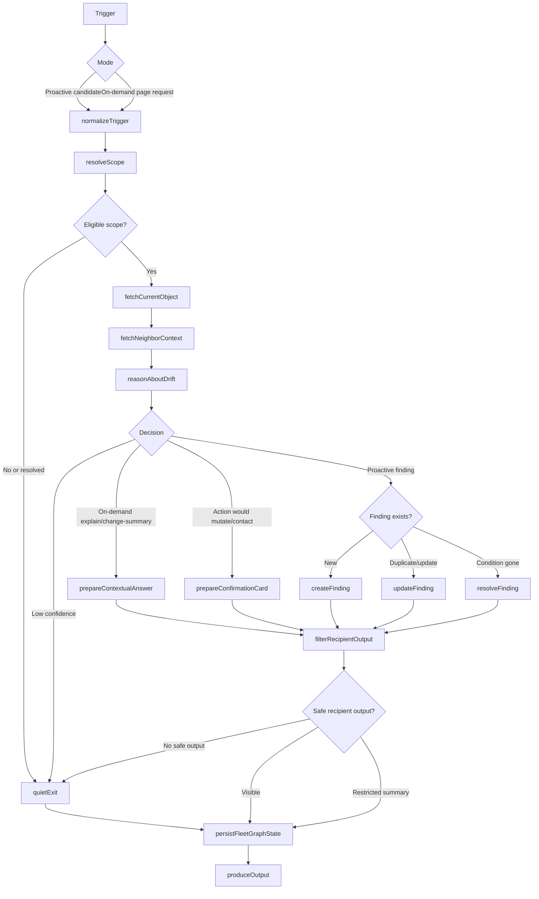

# FleetGraph

FleetGraph is a proactive project drift operator for Ship. It watches deterministic Ship state for execution drift, runs a shared LangGraph for proactive and on-demand reasoning, persists its own findings autonomously, and asks humans before it mutates Ship's source of truth or contacts people.

## MVP Scope

The MVP proves one detector end to end: a blocked issue becomes a contextual notification and explanation loop without mutating Ship source records.

A Ship issue becomes a proactive FleetGraph candidate when all conditions are true:

1. The issue has `state = blocked`.
2. The issue is visible to the actor who will receive the output.
3. The issue has the existing source associations required by the current FleetGraph finding schema.
4. No open FleetGraph finding already covers the same dedupe key.

Priority, current-week membership, owner/assignee, and non-empty blocker text can affect future ordering, routing, or copy. They are not MVP eligibility gates. `issue_iterations.blockers_encountered` supplies blocker explanation/history when present; missing blocker text is itself useful context, not a reason to suppress the issue.

The LLM does not decide which issues are worth checking. SQL-level deterministic candidate selection bounds the graph before model reasoning runs.

The graph's job is not to restate the SQL result. For each eligible issue, FleetGraph must produce the useful work a PM would otherwise do manually: identify the unblock move, name the smallest useful audience, draft the shortest usable ask, and stop before contacting anyone or changing Ship.

## Agent Responsibility

FleetGraph monitors Ship for execution drift that changes the next useful action for a PM, engineer, or director. For MVP, it monitors blocked issues and creates contextual, action-ready findings within the product.

FleetGraph may autonomously:

- Read permitted Ship data from the server-side API process.
- Run deterministic candidate checks.
- Invoke the shared LangGraph for eligible candidates.
- Create, update, dedupe, suppress, and resolve FleetGraph-owned findings.
- Persist run metadata, decision metadata, and shared trace links.
- Draft recommended next actions and unblock messages.

FleetGraph must ask a human before:

- Assigning or reassigning work.
- Changing issue status, priority, sprint/week, due date, or owner.
- Editing documents or canonical Ship work records.
- Posting comments, sending notifications, or escalating to another person.
- Accepting project risk on behalf of a team.

FleetGraph derives project membership from Ship's graph: issue assignees, owners, project/program associations, sprint/week ownership, document associations, recent contributors, workspace roles, PMs, leads, supervisors, admins, and directors. It routes findings to the smallest useful audience and filters evidence to avoid leaking restricted context.

The MVP proactive surface is a notification in the left rail plus source-aware contextual chat. The notification should be visible without opening the exact issue. External comments, messages, Ship mutations, and escalations are not sent without confirmation.

On-demand mode starts from the current page context: object type, object ID, visible state, user role, and permissions. It uses the same graph core as proactive mode. The approved MVP chat loop is contextual explanation from a selected notification/finding. Other actions, including change summaries and draft refinement, remain internal spare parts until explicitly approved.

## Contextual Panel Contract

FleetGraph renders as a contextual intelligence panel, not as a global inbox or standalone chatbot. The panel contract is generic across Ship objects: `issue`, `sprint`, `project`, and future `program` contexts carry the current object type/id, visible context summary, current user's permissions, visible findings, and allowed actions.

The finding shape is detector-agnostic: `kind`, source object ids, severity, title, summary, evidence, recommended action, human-gate state, trace metadata, and draft content when available. MVP emits `kind = blocker`; future detector families should add new kinds without creating a second UI architecture.

The MVP chat surface is a sparse unblock explanation. It should show only the blocker, owner/routing context when known, project/week context when useful, the smallest next action, and uncertainty when it matters. Evidence, trace links, internal enums, and gate metadata stay out of the default PM surface. Current product actions are limited to opening the source issue and discussing the finding in contextual chat. It must not claim that Ship was changed, a message was sent, risk was accepted, or a person was contacted.

The approved contextual chat action records an `explain` run and returns a visible-evidence explanation for the selected finding. It does not accept arbitrary workspace-wide prompts.

## Graph Diagram

Key branches:

- Proactive vs. on-demand trigger.
- Candidate still eligible vs. resolved or low confidence.
- On-demand explanation/change-summary vs. drafted action vs. proactive finding.
- New finding vs. duplicate/update.
- Autonomous FleetGraph state update vs. human approval required for Ship mutation or communication.
- Recipient-visible evidence vs. restricted summary vs. quiet exit.

## Use Cases

| # | Role | Trigger | Agent Detects / Produces | Human Decides |
| --- | --- | --- | --- | --- |
| 1 | PM | A visible issue is marked blocked | Blocked-work finding, owner/assignee when known, sprint/project context when associated, evidence, severity, confidence, next unblock step, draft message/action | Send/edit message, escalate, re-scope, dismiss |
| 2 | PM | Active sprint/week nears end with blocked important work still open | Carryover risk explanation tied to the blocked issue and sprint/week | Re-scope, defer, notify owner, accept risk |
| 3 | Engineer | Engineer opens an assigned blocked issue | Contextual explanation of why it was flagged, linked context, likely next unblock step | Ask PM, update issue, request clarification |
| 4 | Director | Program/project view contains repeated blocked-work findings | Pattern summary across affected work, owners, and projects | Request recovery plan, intervene, dismiss |
| 5 | PM/Director | User asks "why was this flagged?" from an issue or sprint/week page | On-demand explanation using the existing finding and current visible context | Follow up, approve a drafted action, dismiss |

MVP implements use case 1 end to end. The others reuse the same graph shape and are expansion paths after the first detector is working.

## Trigger Model

MVP uses server-side polling inside the existing API process.

- The FleetGraph worker starts with the API process when `FLEETGRAPH_WORKER_ENABLED=true`; Render sets this for the MVP API service.
- It runs once immediately on API boot, then ticks every 2 minutes.
- Each tick runs deterministic SQL candidate checks for blocked issues.
- Eligible candidates enter the shared LangGraph.
- Findings must become visible within 5 minutes of the blocked signal appearing in Ship.

Latency budget for the timed test:

- Up to 120 seconds waiting for the next poll tick.
- Up to 30 seconds for candidate query and bounded context fetch.
- Up to 60 seconds for graph reasoning and trace recording.
- Up to 30 seconds to persist the finding and make it visible in the UI.
- 60 seconds reserved for jitter, retries, or cold-path overhead.

Polling is the right MVP tradeoff because it is reliable, fast to deploy, and catches missed transitions without building an event bus. The long-term architecture is hybrid: Ship events enqueue changed scopes immediately, while polling rechecks open findings, catches missed events, and handles cooldowns.

Cost is candidate-driven, not project-driven:

`daily graph runs = new eligible candidates + due rechecks + on-demand invocations`

Cheap polling can run often. LLM reasoning only runs after deterministic filters produce a bounded candidate.

## Human-in-the-Loop

FleetGraph owns diagnosis state. Ship owns canonical work state.

For MVP, a blocked-work finding may include:

- Title and summary.
- Source issue and sprint/week.
- Evidence snapshot.
- Severity and confidence.
- Recommended next action.
- Draft unblock message/action when that action has been approved for the surface.
- Proposed recipient and why they are the smallest useful audience.
- "Needs you because" explanation for the human gate.
- Shared trace link.

FleetGraph may display this finding without approval. It may not send the draft, post a comment, assign work, change status, move sprint/week scope, or escalate without explicit human confirmation.

The human gate prevents accidental mutation or communication. If sending/posting is not implemented in MVP, the gate stays internal and no PM-facing button should promise that action.

Humans may dismiss findings. FleetGraph may resolve findings when the source condition disappears, but it does not autonomously dismiss a human-visible finding as if a person rejected it. `snooze` is nice-to-have, not required for the architecture defense.

Recipient output is permission-filtered after reasoning. FleetGraph may reason server-side with system attribution, but every user-visible claim must be backed by evidence visible to that user. It may not reveal restricted document titles, hidden project names, private text excerpts, or inferred confidential facts. If the useful evidence is restricted, the output becomes a generic restricted-context summary or quiet exit.

## Observability

FleetGraph uses LangGraph and shared observability traces from day one. LangSmith is acceptable, but any tracing system is acceptable if it provides reviewer-shareable trace links that show distinct proactive and on-demand paths.

In deployed, non-test environments, `runFleetGraph()` auto-captures a LangSmith trace for real worker and API route executions when `LANGSMITH_TRACING=true` or `LANGCHAIN_TRACING_V2=true` and a LangSmith/LangChain API key is configured. Demo scripts still inject explicit trace IDs for repeatable local evidence.

Each graph run records:

- Mode: `proactive` or `on_demand`.
- Trigger reason.
- Source object type and ID.
- Decision: `quiet_exit`, `create_finding`, `update_finding`, `explain`, `refine_draft`, `summarize_changes`, `needs_confirmation`, `dismiss`, `resolve`, or `error`.
- Finding ID when applicable.
- Trace ID or URL.

Shared reviewer traces must use seeded/demo-safe data or redacted metadata. Trace links must not expose raw prompts, raw completions, hidden document IDs/titles, private excerpts, contact details, session tokens, or user tokens.

Required trace evidence:

1. Proactive blocked issue creates a finding.
2. On-demand "why was this flagged?" explains that finding from a contextual page.
3. Proactive run exits quietly because the candidate resolved, is a duplicate, or cannot be safely shown.

Trace debug UI is nice-to-have, not MVP. MVP persists trace metadata and includes submitted trace links in this file or submission notes.

## Deployment Model

FleetGraph runs inside the existing backend API process for MVP.

This avoids an extra service boundary, deployment target, auth path, and operational surface during the one-week sprint. The implementation should still keep clean internal boundaries:

- `fleetgraph/graph`: shared LangGraph nodes and edges.
- `fleetgraph/worker`: 2-minute polling loop and candidate selection.
- `fleetgraph/routes`: contextual on-demand endpoint and finding endpoints.

The worker uses heartbeat/run metadata in the database. MVP assumes a single deployed API worker. If deployment runs multiple API instances, a DB lease becomes required for correctness, not polish: without it, duplicate workers can create duplicate findings, duplicate traces, and unnecessary graph cost.

FleetGraph authenticates server-side using an explicit system attribution path. Long term, this becomes a scoped service principal. The safety rule is unchanged: service-principal access may detect drift, but recipient-facing output must be permission-filtered and cannot leak restricted evidence.

If Ship reads fail, FleetGraph does not create new claims from stale or partial data. It records the failed run, retries on the next tick, and leaves existing findings visible with stale-run metadata. On-demand mode reports the missing context instead of answering from old state.

Public deployment verification on 2026-05-27:

- Render API deploy `dep-d8b5o519rddc73a36gag` for commit `67586bf9da42fe6027a38c8decd4325fe7f80980` reached `live`.
- `https://ship-shape-api.onrender.com/health` returned HTTP 200.
- `https://ship-shape-web.onrender.com` returned HTTP 200.
- After the migrator fix deployed, `https://ship-shape-api.onrender.com/api/fleetgraph/findings?sourceIssueId=...` returned HTTP 401 `No session found`, proving the FleetGraph route is mounted and protected instead of missing.
- `POST https://ship-shape-api.onrender.com/api/fleetgraph/manual-run` returned HTTP 403 `Missing Origin or Referer header`, proving the manual route is mounted and CSRF-protected.
- `render.yaml` enables `FLEETGRAPH_WORKER_ENABLED=true`, `FLEETGRAPH_MANUAL_RUN_API_ENABLED=true`, `LANGSMITH_TRACING=true`, and `LANGCHAIN_TRACING_V2=true` for the API service. The remaining required Render secret is `LANGSMITH_API_KEY` or `LANGCHAIN_API_KEY`; without it, FleetGraph still runs and records local trace metadata, but LangSmith share links cannot be created.

Conclusion: the public API exposes the FleetGraph route family behind normal auth/CSRF gates and the deploy config enables the proactive worker. Future public checks should verify behavior-level route presence, not just `/health`. Reviewer-safe seeded object access and a current authenticated manual-run or worker-created finding screenshot still need human-side review credentials after deployment.

## Test Cases

| # | Ship State | Expected Output | Trace Link |
| --- | --- | --- | --- |
| 1 | Visible issue has `state = blocked` | Proactive graph creates a blocked-work finding with evidence, proposed recipient when known, next step, and human gate metadata | [LangSmith trace](https://smith.langchain.com/public/5dabd395-4bce-4c76-9c26-698d6ff6695d/r): `mode=proactive`, `decision=create_finding`, `nodePath=normalizeTrigger -> resolveScope -> fetchCurrentObject -> filterVisibleEvidence -> reasonProactiveCreate -> persistFleetGraphState -> produceOutput`. |
| 2 | User discusses the notification from the issue/sprint context | On-demand graph explains the existing finding without mutating Ship | [LangSmith trace](https://smith.langchain.com/public/9e47ce59-50fb-4422-9a32-84e36883153d/r): `mode=on_demand`, `decision=explain`, `nodePath=normalizeTrigger -> resolveScope -> fetchCurrentObject -> filterVisibleEvidence -> produceOutput`. |
| 4 | Candidate issue already has an open finding with the same dedupe key | Proactive graph updates or suppresses duplicate finding | Local demo detector output from `pnpm fleetgraph:demo -- --capture-traces`: `decision=update_finding` for `FG Demo - Duplicate open finding control`; focused golden/core tests cover `nodePath=normalizeTrigger -> resolveScope -> fetchCurrentObject -> filterVisibleEvidence -> refreshExistingFinding -> persistFleetGraphState -> produceOutput`. |
| 5 | Blocked signal is removed before recheck | Proactive graph resolves or quietly exits | Nice-to-have |
| 6 | Evidence is not visible to current user | Graph returns restricted-context output or quiet exit | Nice-to-have |

## Architecture Decisions

- Use LangGraph for the shared graph and shared trace links for reviewer evidence.
- Run inside the API process for MVP, with clean module boundaries for later extraction.
- Use deterministic SQL candidate selection before LLM reasoning.
- Persist FleetGraph-owned findings rather than mutating Ship work records.
- Make proactive mode responsible for findings; the MVP UI renders a notification and exposes bounded contextual explanation for the selected finding.
- Implement contextual UI first. A global FleetGraph panel is not MVP.
- Persist trace metadata. A reviewer/debug trace UI is nice-to-have.
- Use heartbeat/run metadata first. DB lease is not MVP for a single deployed worker, but is required if production runs multiple API instances.
- Keep a dedicated FleetGraph worker process with durable `fleetgraph_jobs` as the preferred post-MVP reliability path once API horizontal scaling or operational SLA pressure appears.

## Cost Analysis

FleetGraph MVP is currently running in deterministic text mode for reviewer/demo paths. The graph records token/cost metadata on every run, but the captured local demo and test runs made zero model calls.

Actual local run accounting from `fleetgraph_runs` after `pnpm fleetgraph:demo -- --capture-traces` on 2026-05-27:

| Mode | Decision | Runs | Model calls | Input tokens | Output tokens | Estimated cost |
| --- | --- | ---: | ---: | ---: | ---: | ---: |
| on_demand | explain | 27 | 0 | 0 | 0 | $0 |
| on_demand | refine_draft | 20 | 0 | 0 | 0 | $0 |
| proactive | create_finding | 19 | 0 | 0 | 0 | $0 |
| proactive | resolve | 1 | 0 | 0 | 0 | $0 |
| proactive | update_finding | 8 | 0 | 0 | 0 | $0 |

Development/test model spend for the captured FleetGraph MVP path: **$0**. This is not a claim that production reasoning will be free; it is an honest report that the current reviewer-safe graph path uses deterministic generation and records zero model calls.

Production assumptions if real proactive-create model calls are enabled later:

- Polling ticks: every 2 minutes, 720 ticks/day.
- LLM cost on empty ticks: zero.
- Normal proactive finding target: 2,000-4,000 input tokens and 500-1,000 output tokens per model-backed create.
- Heavier rollups are not part of MVP.
- Main cost cliffs: broad workspace reasoning, noisy candidate generation, repeated duplicate processing, oversized context, and broad on-demand prompts.

Working formula:

`monthly cost = (proactive graph runs + rechecks + on-demand runs) * average model cost per run`

Scale projection, using $0 for deterministic MVP paths and a planning placeholder of $0.01 per future model-backed graph run:

| Scale | Monthly deterministic MVP cost | If future model-backed runs average $0.01 | Assumption |
| --- | ---: | ---: | --- |
| 100 users | $0 | $6.30-$12.90/month | 1-3 proactive creates/day plus 20-40 on-demand runs/day |
| 1,000 users | $0 | $63-$129/month | 10-30 proactive creates/day plus 200-400 on-demand runs/day |
| 10,000 users | $0 | $630-$1,290/month | 100-300 proactive creates/day plus 2,000-4,000 on-demand runs/day |

The most dangerous cost assumption is not polling. It is broad on-demand prompts that expand from one page into whole-workspace reasoning.

Mitigations:

- Deterministic candidate filters.
- Dedupe keys.
- Finding status and recheck metadata.
- Severity ranking.
- Bounded context fetches.
- Permission-filtered evidence.
- Scope narrowing for broad on-demand requests.

## Non-MVP / Later

- Hybrid event + polling trigger model.
- Dedicated FleetGraph worker process with durable job claiming, retries, lease expiry, and dead-letter/cleanup policy.
- Global FleetGraph panel.
- Trace/debug reviewer UI.
- Snooze support.
- DB lease for multiple API instances.
- External notifications/comments after approval.
- Additional detectors: orphaned high-priority work, missing owner, sprint carryover risk, silent accountable owner, program-level repeated drift.

## Direction If Time

FleetGraph should grow toward a project risk ledger and drift autopilot, but the week-five promise stays the action-ready blocked-work loop.

Potential stretches must fight for their existence. Draft refinement, finding timelines, stale labels, at-risk labels, and dismiss/snooze are candidates only after the notification-to-chat loop proves the current context and blocked issue truth clearly.

After that, additional detectors should reuse the same graph and findings model: sprint carryover risk, silent owner, orphaned high-priority work, missing execution context, and program-level repeated drift. These should not become separate assistants. They are more ways to update the same risk ledger and prepare the next useful action.

Future blocker modeling should consider explicit issue-to-issue dependency links: "this issue is blocked by that issue" and automatic unblock cues when the blocking issue closes. That is useful, but it is not required for the Epic 8 reviewer demo path.
