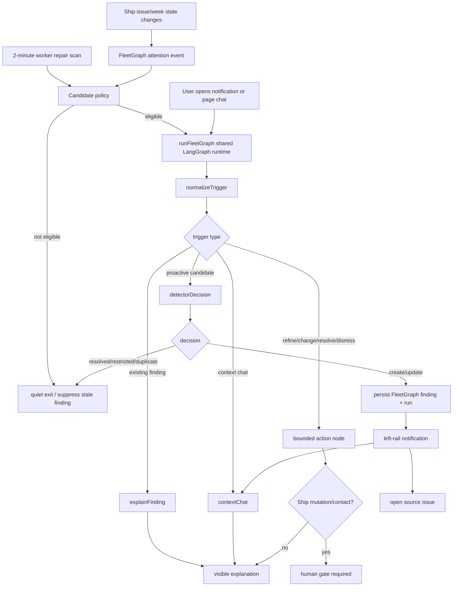

# Agent Responsibility

FleetGraph is Ship's project intelligence and attention engine. It watches real Ship work state, decides when a condition deserves attention, routes the finding to the smallest useful audience, and gives users a context-aware explanation path.

## Final Claim Boundary

FleetGraph claims shared graph orchestration, deterministic candidate policy, deployed worker execution, FleetGraph-owned finding/run persistence, human-gated next actions, bounded page-aware context chat, authenticated live reviewer proof, public static proof snapshots, and measured FleetGraph graph-runtime token/cost metadata. It does not claim autonomous Ship mutation/contact, broad Director recovery planning, or development-wide coding-assistant spend instrumentation.

Live reviewer control room: `/fleetgraph/reviewer` in the authenticated app. Mutating controls require workspace admin plus `FLEETGRAPH_REVIEWER_PROOF_ENABLED=1`.

Public proof packet after final deployed proof: `https://ship-shape-web.onrender.com/fleetgraph-observability/proof/latest.html`. Local-only proof packets intentionally do not publish to that URL. Static proof is a snapshot of the live verifier chain, not the authority.

What it monitors proactively:

| Signal | Source state | Surfaced when |
| --- | --- | --- |
| Blocked | Issue `state = blocked` with the source association required by the current FleetGraph finding model | A visible active associated issue is blocked, including missing blocker text |
| Stale | Issue `state = in_progress` or `in_review` | No meaningful issue update for 30+ days |
| At risk | High/urgent current-week work | The issue has no assignee or is within 3 days of sprint end |

What it can do autonomously:

- Read permitted Ship state.
- Claim FleetGraph attention events and run the 2-minute repair scan.
- Create, update, suppress, or resolve FleetGraph-owned findings.
- Persist runs, evidence snapshots, trace metadata, and notification read state.
- Surface in-app notifications and context chat answers.

What always requires a human:

- Mutating Ship source records: status, owner, priority, sprint/week, title, content, due date.
- Contacting another person or posting a comment/message.
- Escalating to a director or accepting delivery risk on behalf of the team.

Who it notifies:

- Issue assignee or owner first.
- Project owner/PM when execution ownership is missing or the action is project-level.
- Program/workspace admin only as fallback for orphaned or escalated work.
- Visibility wins over routing: restricted evidence becomes no-safe-output, not a leak.

How on-demand mode uses current view:

- The chat request carries a bounded context capsule: route, surface (`issues_list`, `scoped_issues_list`, `my_week`, `document_issue_tab`, `dashboard`, `workspace`), title, filters, sort/view mode, counts, up to 25 visible item summaries, up to 8 selected IDs, issue/document/sprint/project/program/workspace identifiers, and any selected notification/finding.
- The server treats client labels as hints only; selected/visible IDs are enriched through existing document authorization.
- The same `runFleetGraph` graph boundary handles proactive and on-demand paths. The trigger differs; the graph runtime does not fork into separate products.

# Graph Diagram



Primary runtime boundary: `api/src/fleetgraph/core.ts`. Proactive execution enters through `api/src/fleetgraph/execution/worker.ts`. User-facing routes enter through `api/src/routes/fleetgraph.ts`.

# Use Cases

| # | Role | Trigger | Agent detects / produces | Human decides |
| ---: | --- | --- | --- | --- |
| 1 | PM | Issue becomes blocked | Notification, source issue, blocker reason or missing-reason gap, owner/assignee, next unblock step | Ask owner, edit/send message, move work, or accept risk |
| 2 | Engineer | Opens contextual chat from a finding/source issue | Explanation of why it was flagged, visible evidence, and next step | Follow up, ask deeper question, or update the issue manually |
| 3 | PM | Active work has no meaningful update for 30+ days | Stale-work attention signal with source and suggested review action | Revive, close, reassign, or defer the work |
| 4 | PM/Director | High/urgent current-week issue lacks owner or nears sprint end | At-risk signal with sprint context and likely accountable audience | Assign owner, re-scope, escalate, or accept carryover |
| 5 | PM/Director | Multiple attention findings are visible in a scoped issue/project/program tab | Page-aware chat can summarize the visible bounded list and selected sources | Ask for a human-owned recovery plan, reassign attention, or accept risk |

# Trigger Model

FleetGraph uses a hybrid trigger model:

- Event path: issue mutations enqueue durable `fleetgraph_attention_events`; the worker claims pending events and evaluates changed sources.
- Repair path: a 2-minute server-side worker scan catches missed events and revalidates open findings.
- Test path: `POST /api/fleetgraph/test/worker-tick` is available only in `NODE_ENV=test` and admin-gated for deterministic local E2E proof.
- Reviewer path: `POST /api/fleetgraph/reviewer/scenarios/week-blocker` creates/reuses the canonical current-week blocked issue proof chain and can trigger a deployed-safe worker tick when the reviewer env gate is enabled.

Deployment stance:

- Render starts the API-process worker with `FLEETGRAPH_WORKER_ENABLED=true`.
- The worker uses DB leases/advisory locks so duplicate API instances do not double-scan.
- Final deployed proof requires recent `fleetgraph_worker_ticks`, findings/runs for `blocked`, `stale`, and `at_risk`, and no stuck expired worker ticks.

Latency defense:

- Worker interval default: 120,000 ms.
- Local timed E2E asserts mutation-created event processing under 30 seconds when the test worker trigger is invoked.
- Production target remains under 5 minutes: event claim or next 2-minute repair scan, bounded context fetch, graph run, persisted finding, notification visible.

# Test Cases

Final submission proof is all-signal: every claimed signal must have executable proof and deployed evidence.

| # | Ship state | Expected output | Public trace evidence |
| ---: | --- | --- | --- |
| 1 | Visible issue has `state = blocked` and blocker text | Proactive `create_finding`, notification visible, no Ship mutation claim | Required decision `create_finding`; observed `create_finding`; https://smith.langchain.com/public/b10f640b-5e14-4ab0-9d10-f8e3156a96ae/r |
| 2 | Visible active issue has no meaningful update for 30+ days | Proactive `create_finding`, stale notification, human-gated review/close action | Required decision `create_finding`; observed `create_finding`; https://smith.langchain.com/public/f031eb34-de29-4d61-91f2-7dc2752d45c8/r |
| 3 | Visible high/urgent current-week issue is unowned or near sprint end | Proactive `create_finding`, at-risk notification, human-gated owner/scope action | Required decision `create_finding`; observed `create_finding`; https://smith.langchain.com/public/cbddd03f-bbe0-47b9-b4ac-f1144a95042d/r |
| 4 | User asks from existing finding or page context | On-demand `explain`/chat path returns visible evidence, page context, and next action | Required decision `explain`; observed `explain`; https://smith.langchain.com/public/2cccea43-ab44-4228-9f04-5f4b331aed3a/r |
| 5 | Chat asks for next action on a source/finding | On-demand answer preserves human gate; source issue remains unchanged after chat | Required decision `explain`; observed `explain`; https://smith.langchain.com/public/2cccea43-ab44-4228-9f04-5f4b331aed3a/r; source-unchanged proof: `e2e/fleetgraph-attention-loop.spec.ts` |
| 6 | Source condition disappears or evidence becomes unsafe | Finding resolves/suppresses or quiet-exits without model cost | Required decision `quiet_exit`; observed `quiet_exit`; https://smith.langchain.com/public/ebbd915c-6ddb-4b68-a015-a8cfbfc403e6/r |
| 7 | Reviewer runs current-week blocker scenario in `/fleetgraph/reviewer` | Live chain shows source -> attention event -> worker tick -> graph run -> trace -> finding -> notification projection -> chat/human gate under 5 minutes | Required decision `create_finding`; observed `create_finding`; https://smith.langchain.com/public/b10f640b-5e14-4ab0-9d10-f8e3156a96ae/r; live chain `e6ba6f41-01c2-43fc-a286-f9d8da6328b8` |

Required proof command:

```bash
FLEETGRAPH_PROOF_API_URL=https://ship-shape-api.onrender.com \
FLEETGRAPH_PROOF_WEB_URL=https://ship-shape-web.onrender.com \
FLEETGRAPH_PROOF_RENDER_POSTGRES=ship-shape-db \
E2E_RESULTS_DIR=test-results/fleetgraph-proof \
pnpm fleetgraph:proof -- --mode both --with-e2e

pnpm fleetgraph:proof:check
pnpm fleetgraph:proof:verify-traces
```

# Architecture Decisions

| Decision | Implementation | Defense |
| --- | --- | --- |
| One graph boundary | `runFleetGraph` in `api/src/fleetgraph/core.ts` compiles a shared LangGraph `StateGraph` | Proactive and on-demand modes branch inside one runtime |
| Deterministic detection first | `api/src/fleetgraph/detection/attention-policy.ts` maps Ship issue context to `blocked`, `stale`, or `at_risk` | Avoids spending model tokens on broad scans |
| FleetGraph owns diagnosis state only | Findings, runs, attention events, worker ticks, and read state are FleetGraph-owned tables | Ship issues/weeks/projects remain source of truth |
| Human gate before consequences | Chat/action output marks approval required for mutation/contact-like work | Prevents fake autonomy and source-record changes without approval |
| Context chat is bounded | `/api/fleetgraph/chat` supports context-attached prompts, not a standalone workspace chatbot | Satisfies embedded-context requirement without turning into generic chat |
| Page context is capped | `FleetGraphPageContext` carries route/surface/filter/count/visible/selected hints with strict caps | Improves page awareness without raw DOM snapshots or hidden fields |
| Observability is provider-neutral | `api/src/fleetgraph/observability-trace.ts` emits sanitized LangSmith/Langfuse evidence | Advisor clarification allows equivalent trace links; public traces stay reviewer-safe |
| Live proof is an authenticated product surface | `/fleetgraph/reviewer` assembles deployed proof chains from durable FleetGraph ledgers | Reviewers inspect moving parts directly; static proof becomes a generated snapshot |

Public API/interface additions:

- `GET /api/fleetgraph/findings`
- `GET /api/fleetgraph/notifications`
- `POST /api/fleetgraph/notifications/read`
- `POST /api/fleetgraph/findings/{findingId}/read`
- `POST /api/fleetgraph/findings/{findingId}/explain`
- `POST /api/fleetgraph/findings/{findingId}/refine`
- `POST /api/fleetgraph/findings/{findingId}/dismiss` when admin-authorized
- `POST /api/fleetgraph/chat`
- `POST /api/fleetgraph/manual-run` when explicitly enabled
- `GET /api/fleetgraph/reviewer/chains`
- `GET /api/fleetgraph/reviewer/chains/{chainId}`
- `POST /api/fleetgraph/reviewer/scenarios/week-blocker` when admin-authorized and `FLEETGRAPH_REVIEWER_PROOF_ENABLED=1`
- `POST /api/fleetgraph/reviewer/worker-tick` when admin-authorized and `FLEETGRAPH_REVIEWER_PROOF_ENABLED=1`
- `POST /api/fleetgraph/reviewer/proof` when admin-authorized and `FLEETGRAPH_REVIEWER_PROOF_ENABLED=1`
- `POST /api/fleetgraph/test/worker-tick` only in test mode

Shared wire types live in `shared/src/types/fleetgraph.ts`: findings, notifications, visible output, trace metadata, chat request/response, signal types, evidence, manual-run response, and reviewer proof chains.

# Cost Analysis

Measured FleetGraph spend is graph-runtime spend from `fleetgraph_runs.token_metadata` and `fleetgraph_runs.cost_metadata`, plus any controlled production model proof sample. Development-wide Claude/API/coding-assistant spend was not instrumented and is explicitly excluded.

Required proof fields:

| Item | Amount |
| --- | ---: |
| Graph invocations | From `fleetgraph_runs` in the proof window |
| Model calls | Sum of `token_metadata.modelCalls` |
| Input/output/total tokens | Sum of `token_metadata.inputTokens`, `outputTokens`, and `totalTokens` |
| Estimated model spend | Sum of `cost_metadata.estimatedCostUsd` |
| Deterministic runs | Runs with zero model calls |
| Real-model proof runs | Runs with nonzero model calls |

Pricing assumption used by the current FleetGraph scripts when provider cost is estimated:

- Input: `$0.15 / 1M tokens`.
- Output: `$0.60 / 1M tokens`.
- Blocked proactive create can call the model only when `FLEETGRAPH_REAL_MODEL_ENABLED=true`, `FLEETGRAPH_MODEL` is configured, and `OPENAI_API_KEY` exists.
- Stale, at-risk, quiet, explain, refine, dismiss, and resolve paths remain deterministic/zero-token by default unless a future proof explicitly changes that boundary.

Production projections are generated into the proof packet for 100, 1,000, and 10,000 users using the measured cost-per-graph-invocation in the current proof window and an explicit assumption of 30 graph invocations per user per month. If the proof window has no real-model runs, projected model spend correctly remains `$0` and the proof must say deterministic-first rather than imply measured model use.

Cost cliffs and controls:

- Full-workspace reasoning is not allowed; SQL selects candidates first.
- No-candidate worker ticks spend zero model tokens.
- Open findings use dedupe keys and suppression/update paths instead of repeated creates.
- Context chat is scoped to the current page/finding capsule.
- Program-wide summaries are future work and would need separate budgets before enabling.
