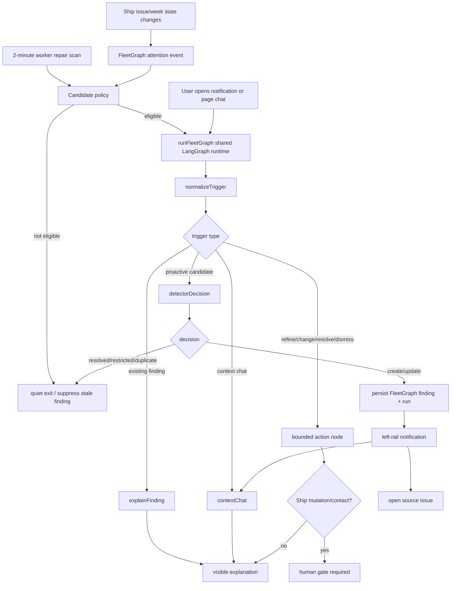

# Agent Responsibility

FleetGraph is Ship's project intelligence and attention engine. It watches real Ship work state, decides when a condition deserves attention, routes the finding to the smallest useful audience, and gives users a context-aware explanation path.

What it monitors proactively:

| Signal | Source state | Surfaced when |
| --- | --- | --- |
| Blocked | Issue `state = blocked` | Any visible active issue is blocked, including missing blocker text |
| Stale | Issue `state = in_progress` or `in_review` | No meaningful issue update for 180+ days |
| At risk | High/urgent current-week work | The issue has no assignee or is within 3 days of sprint end |

What it can do autonomously:

- Read permitted Ship state.
- Claim FleetGraph attention events and run the 2-minute repair scan.
- Create, update, suppress, or resolve FleetGraph-owned findings.
- Persist runs, evidence snapshots, trace metadata, and notification read state.
- Surface in-app notifications and context chat answers.

What always requires a human:

- Mutating Ship source records: status, owner, priority, sprint/week, title, content, due date.
- Contacting another person or posting a comment/message.
- Escalating to a director or accepting delivery risk on behalf of the team.

Who it notifies:

- Issue assignee or owner first.
- Project owner/PM when execution ownership is missing or the action is project-level.
- Program/workspace admin only as fallback for orphaned or escalated work.
- Visibility wins over routing: restricted evidence becomes no-safe-output, not a leak.

How on-demand mode uses current view:

- The chat request carries a bounded context capsule: issue/document/sprint/project/program/workspace identifiers plus any selected notification/finding.
- The active page context is the anchor; notification context can add source evidence.
- The same `runFleetGraph` graph boundary handles proactive and on-demand paths. The trigger differs; the graph runtime does not fork into separate products.

# Graph Diagram



Primary runtime boundary: `api/src/fleetgraph/core.ts`. Proactive execution enters through `api/src/fleetgraph/execution/worker.ts`. User-facing routes enter through `api/src/routes/fleetgraph.ts`.

# Use Cases

| # | Role | Trigger | Agent detects / produces | Human decides |
| ---: | --- | --- | --- | --- |
| 1 | PM | Issue becomes blocked | Notification, source issue, blocker reason or missing-reason gap, owner/assignee, next unblock step | Ask owner, edit/send message, move work, or accept risk |
| 2 | Engineer | Opens contextual chat from a finding/source issue | Explanation of why it was flagged, visible evidence, and next step | Follow up, ask deeper question, or update the issue manually |
| 3 | PM | Active work has no meaningful update for 180+ days | Stale-work attention signal with source and suggested review action | Revive, close, reassign, or defer the work |
| 4 | PM/Director | High/urgent current-week issue lacks owner or nears sprint end | At-risk signal with sprint context and likely accountable audience | Assign owner, re-scope, escalate, or accept carryover |
| 5 | Director | Multiple attention findings exist under a project/program | Compact set of blocked/stale/at-risk items with source links and human-gated next actions | Ask for recovery plan, reassign attention, or accept risk |

# Trigger Model

FleetGraph uses a hybrid trigger model:

- Event path: issue mutations enqueue durable `fleetgraph_attention_events`; the worker claims pending events and evaluates changed sources.
- Repair path: a 2-minute server-side worker scan catches missed events and revalidates open findings.
- Test path: `POST /api/fleetgraph/test/worker-tick` is available only in `NODE_ENV=test` and admin-gated for deterministic local E2E proof.

Deployment stance:

- Render starts the API-process worker with `FLEETGRAPH_WORKER_ENABLED=true`.
- The worker uses DB leases/advisory locks so duplicate API instances do not double-scan.
- Final deployed proof requires recent `fleetgraph_worker_ticks`, findings/runs for `blocked`, `stale`, and `at_risk`, and no stuck expired worker ticks.

Latency defense:

- Worker interval default: 120,000 ms.
- Local timed E2E asserts mutation-created event processing under 30 seconds when the test worker trigger is invoked.
- Production target remains under 5 minutes: event claim or next 2-minute repair scan, bounded context fetch, graph run, persisted finding, notification visible.

# Test Cases

Final submission proof is all-signal: every claimed signal must have executable proof and deployed evidence.

| # | Ship state | Expected output | Evidence |
| ---: | --- | --- | --- |
| 1 | Visible issue has `state = blocked` and blocker text | Proactive `create_finding`, notification visible, no Ship mutation claim | Golden case `fg-create-blocked-visible-issue`; deployed proof packet signal `blocked`; LangSmith proactive create: https://smith.langchain.com/public/ad258212-2b31-4c36-88f2-ad91401a7d86/r |
| 2 | Visible active issue has no meaningful update for 180+ days | Proactive `create_finding`, stale notification, human-gated review/close action | Golden case `fg-create-stale-visible-issue`; deployed proof packet signal `stale`; demo trace `fleetgraph.proactive_stale` when tracing is configured |
| 3 | Visible high/urgent current-week issue is unowned or near sprint end | Proactive `create_finding`, at-risk notification, human-gated owner/scope action | Golden case `fg-create-at-risk-visible-issue`; deployed proof packet signal `at_risk`; demo trace `fleetgraph.proactive_at_risk` when tracing is configured |
| 4 | User asks from existing finding context | On-demand `explain` path returns visible evidence and next action | Golden case `fg-explain-existing-finding`; LangSmith explain: https://smith.langchain.com/public/2cccea43-ab44-4228-9f04-5f4b331aed3a/r |
| 5 | Chat asks for next action on a source/finding | Human gate required; source issue remains unchanged after chat | `e2e/fleetgraph-attention-loop.spec.ts`; proof packet attention loop has no skipped steps when run with `--with-e2e` |
| 6 | Source condition disappears or evidence becomes unsafe | Finding resolves/suppresses or quiet-exits without model cost | Golden cases `fg-resolve-condition-gone`, `fg-restricted-source-hidden`, and `fg-quiet-done-cancelled` |

Required proof command:

```bash
FLEETGRAPH_PROOF_API_URL=https://ship-shape-api.onrender.com \
FLEETGRAPH_PROOF_WEB_URL=https://ship-shape-web.onrender.com \
FLEETGRAPH_PROOF_RENDER_POSTGRES=ship-shape-db \
E2E_RESULTS_DIR=test-results/fleetgraph-proof \
pnpm fleetgraph:proof -- --mode both --with-e2e

pnpm fleetgraph:proof:check
```

# Architecture Decisions

| Decision | Implementation | Defense |
| --- | --- | --- |
| One graph boundary | `runFleetGraph` in `api/src/fleetgraph/core.ts` compiles a shared LangGraph `StateGraph` | Proactive and on-demand modes branch inside one runtime |
| Deterministic detection first | `api/src/fleetgraph/detection/attention-policy.ts` maps Ship issue context to `blocked`, `stale`, or `at_risk` | Avoids spending model tokens on broad scans |
| FleetGraph owns diagnosis state only | Findings, runs, attention events, worker ticks, and read state are FleetGraph-owned tables | Ship issues/weeks/projects remain source of truth |
| Human gate before consequences | Chat/action output marks approval required for mutation/contact-like work | Prevents fake autonomy and source-record changes without approval |
| Context chat is bounded | `/api/fleetgraph/chat` supports context-attached prompts, not a standalone workspace chatbot | Satisfies embedded-context requirement without turning into generic chat |
| Observability is provider-neutral | `api/src/fleetgraph/observability-trace.ts` emits sanitized LangSmith/Langfuse evidence | Advisor clarification allows equivalent trace links; public traces stay reviewer-safe |
| Reviewer proof stays out of product UI | Trace links, run metadata, worker DB evidence, and eval scores live in docs/reports | UI stays focused on user decisions |

Public API/interface additions:

- `GET /api/fleetgraph/findings`
- `GET /api/fleetgraph/notifications`
- `POST /api/fleetgraph/notifications/read`
- `POST /api/fleetgraph/findings/{findingId}/read`
- `POST /api/fleetgraph/findings/{findingId}/explain`
- `POST /api/fleetgraph/findings/{findingId}/refine`
- `POST /api/fleetgraph/findings/{findingId}/dismiss` when admin-authorized
- `POST /api/fleetgraph/chat`
- `POST /api/fleetgraph/manual-run` when explicitly enabled
- `POST /api/fleetgraph/test/worker-tick` only in test mode

Shared wire types live in `shared/src/types/fleetgraph.ts`: findings, notifications, visible output, trace metadata, chat request/response, signal types, evidence, and manual-run response.

# Cost Analysis

Measured FleetGraph observability spend is from generated FleetGraph graph runs, not total Claude development spend. Development-wide Claude/API spend was not fully instrumented in this repo.

Latest measured observability trial:

| Item | Amount |
| --- | ---: |
| Model calls | 1 |
| Total tokens | 180 |
| Estimated spend | `$0.0000675` |
| Score pass/fail | 32/0 |

Pricing assumption used by the current FleetGraph scripts:

- Input: `$0.15 / 1M tokens`.
- Output: `$0.60 / 1M tokens`.
- Blocked proactive create can call the model only when explicitly enabled.
- Stale, at-risk, quiet, explain, refine, dismiss, and resolve paths are deterministic/zero-token by default.

Production projection assumptions:

- 10 users per active project.
- 2 proactive model-backed findings per project per day.
- 1 on-demand model-backed invocation per user per day.
- Average model-backed invocation: 3,000 input tokens + 750 output tokens.
- Cost per average model-backed invocation: `$0.0009`.
- SQL-only worker ticks and deterministic quiet exits are treated as zero model cost.

| Scale | Projects | Proactive runs/month | On-demand runs/month | Estimated monthly model cost |
| ---: | ---: | ---: | ---: | ---: |
| 100 users | 10 | 600 | 3,000 | `$3.24` |
| 1,000 users | 100 | 6,000 | 30,000 | `$32.40` |
| 10,000 users | 1,000 | 60,000 | 300,000 | `$324.00` |

Cost cliffs and controls:

- Full-workspace reasoning is not allowed; SQL selects candidates first.
- No-candidate worker ticks spend zero model tokens.
- Open findings use dedupe keys and suppression/update paths instead of repeated creates.
- Context chat is scoped to the current page/finding capsule.
- Program-wide summaries are future work and would need separate budgets before enabling.
