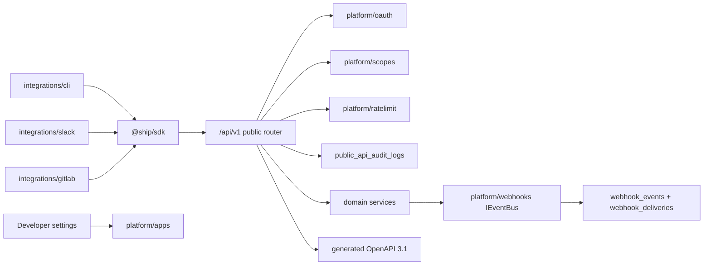
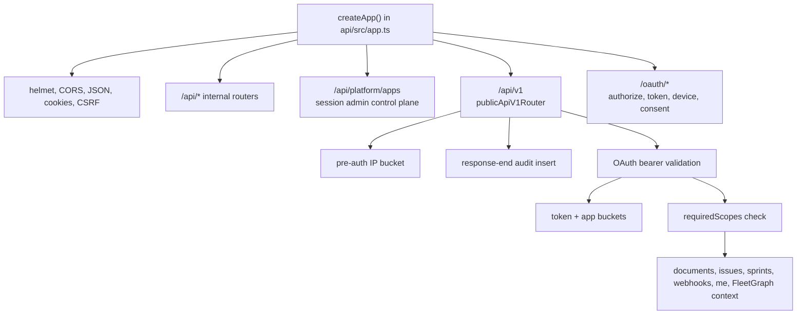
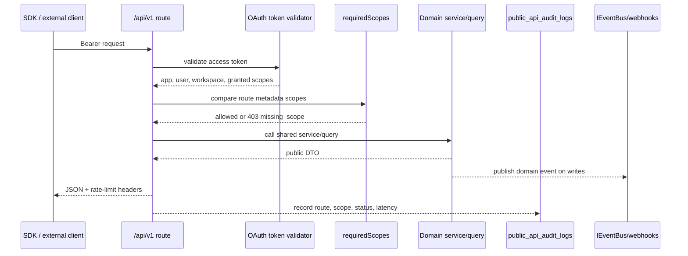
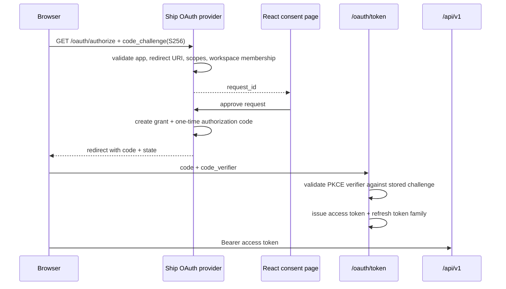
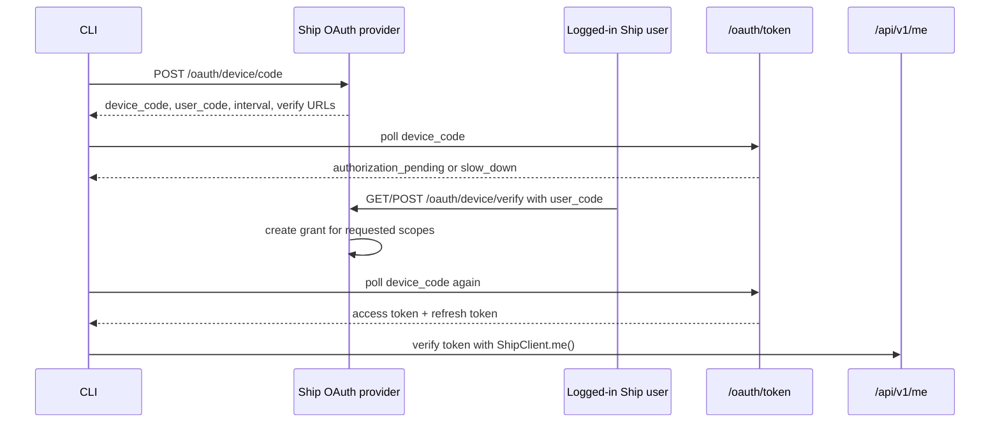
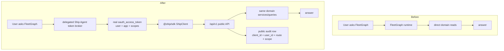

# Plugforge Architecture

Ship's Week 6 platform work turns the existing document app into a public developer platform without forking the product model. Internal routes stay under `/api/*`; external clients use `/api/v1/*`, OAuth apps, scopes, generated OpenAPI, signed webhooks, and the hand-authored `@ship/sdk`.

## Module Layout

```text
api/src/platform/
  apps/        OAuth app control plane: registration, shown-once secrets, rotation, first-party agent app, and public API audit queries.
  oauth/       Authorization Code + PKCE, Device Grant, token exchange, refresh rotation, bearer validation, and agent token broker.
  scopes/      Scope registry backed by shared `PUBLIC_API_SCOPES`; new scopes are data, not middleware rewrites.
  ratelimit/   Public rate-limit header constants used by `/api/v1` middleware.
  webhooks/    Event registry, `IEventBus`, subscription matching, signing, delivery, retry, DLQ, and replay.
  api/v1/      Public REST boundary: route metadata, middleware, resources, pagination, errors, and OpenAPI generation.

sdk/
  src/index.ts       `ShipClient`, OAuth helpers, resource clients, token refresh, and public exports.
  src/resources.ts   Resource-segregated clients for documents, issues, sprints, FleetGraph context, and webhooks.
  src/token-store.ts Memory, browser, and file token stores.
  src/errors.ts      `ShipError` discriminated error data.
  src/webhook.ts     `verifyWebhook(headers, rawBody, secret, toleranceSec?)`.

integrations/
  cli/      Packed TTFE reference client for Device Grant, document create, webhook tail, and signature verification.
  slack/    SDK-only Slack OAuth/webhook receiver that posts `document.created` and `issue.assigned`.
  gitlab/   SDK-only GitLab webhook receiver that upserts merge request links onto existing Ship issues.
```

`openapi` and `audit` are platform modules, but not standalone directories: public OpenAPI lives in `api/src/platform/api/v1/openapi.ts` and `route-metadata.ts`; public audit rows are recorded by `api/src/platform/api/v1/middleware.ts` and queried through `api/src/platform/apps/service.ts`.



## SOLID Rationale

Single Responsibility: HTTP adapters stay thin. `api/src/platform/oauth/http-routes.ts` parses protocol requests, while `api/src/platform/oauth/provider.ts` owns authorization requests, grants, codes, device polling, token exchange, and refresh rotation. Public resource routes such as `api/src/platform/api/v1/documents.ts` delegate document writes to domain mutation services instead of reimplementing document behavior.

Open/Closed: `api/src/platform/api/v1/route-metadata.ts` and `api/src/platform/scopes/registry.ts` make routes and scopes executable data. Adding a public operation means adding metadata and schemas that the OpenAPI generator and fitness tests can walk; existing auth middleware does not need a special branch per route.

Liskov Substitution: `api/src/platform/webhooks/deliverer.ts` defines `IWebhookDeliverer`, and `api/src/platform/webhooks/service.ts` accepts injected clock, database, deliverer, timeout, and URL validator dependencies. Production uses `FetchWebhookDeliverer`; tests substitute deterministic transport and time without changing webhook behavior.

Interface Segregation: `sdk/src/resources.ts` exposes separate `DocumentsClient`, `IssuesClient`, `SprintsClient`, `WebhooksClient`, and FleetGraph context clients. Consumers depend on the resource surface they use instead of one large untyped client.

Dependency Inversion: Domain writes publish through `IEventBus` in `api/src/platform/webhooks/event-bus.ts`, and webhook delivery depends on `IWebhookDeliverer`, not `fetch` directly. The platform service owns durable event/delivery persistence; transport is a plug-in dependency.

## Composition Root

`api/src/app.ts` is the composition root. It mounts internal Ship routes with session/CSRF protection, then mounts the public platform boundary and OAuth protocol endpoints.



Production wiring uses the default webhook dependencies in `api/src/platform/webhooks/service.ts`: system clock, Postgres pool, `FetchWebhookDeliverer`, URL validation, and 5 second delivery timeout. Test wiring calls `configureWebhookServiceDependencies()` with a fake clock, fake or test database runner, and deterministic deliverer; retry tests advance injected time instead of sleeping with `setTimeout`.

## Public/Internal Boundary

The public/internal split is a one-way door. `/api/v1/*` routes use public route metadata, Zod schemas from `@ship/shared`, OAuth bearer auth, scope checks, public rate limits, public audit rows, cursor envelopes, and `ApiError { code, message, details?, request_id }`. Public routes call shared domain/query/mutation services; they must not import internal Express handlers.



OpenAPI is generated, not written. `api/src/platform/api/v1/openapi.ts` walks `publicApiV1RouteRegistry` from `route-metadata.ts` and shared Zod schemas to serve OpenAPI 3.1 at `/api/v1/openapi.json`; `docs/openapi.json` is the generated static copy.

External issue links are public issue metadata, not a new table. `POST /api/v1/issues/:id/external-links` validates `provider`, `external_id`, `kind`, `url`, `title`, optional `status`, and server timestamps, then idempotently upserts by `provider + external_id` into `documents.properties.external_links`. GitLab uses this seam through `client.issues.upsertExternalLink()`; integrations do not import internal issue handlers.

## OAuth Flows

Authorization Code + PKCE is for browser apps. The consent page is in the web UI, but protocol state lives in `api/src/platform/oauth/provider.ts`.



Refresh rotation happens on `grant_type=refresh_token`: `rotateRefreshToken()` marks the old refresh token used, inserts the replacement token, issues a new access token, and invalidates the entire family if a used refresh token appears again.

Device Grant is for the CLI and TTFE drill.



## Webhook Pipeline

Domain writes publish webhook events through `IEventBus`. The pipeline persists a canonical `webhook_events` row and `webhook_deliveries` rows before dispatch, then signs and sends each delivery. The `Idempotency-Key` originates from the event idempotency key, is stored on the delivery row, and is reused for retries and replay.

```mermaid
flowchart LR
  Source["Document / issue / sprint domain write"] --> Bus["IEventBus publish()"]
  Bus --> Registry["event registry + Zod payload validation"]
  Registry --> EventRow["webhook_events\nidempotency_key"]
  EventRow --> Matcher["subscription matcher\napp + event + read-context check"]
  Matcher --> DeliveryRow["webhook_deliveries\nattempt 1, pending"]
  DeliveryRow --> Signer["signer\nShip-Signature = HMAC(secret, timestamp.rawBody)"]
  Signer --> Deliverer["IWebhookDeliverer"]
  Deliverer --> Result["2xx success / 429+5xx retry / 4xx DLQ"]
  Result --> Retry["retry scheduler\n1s, 4s, 16s, 1m, 5m, 30m"]
  Retry --> DeliveryLog["delivery log + DLQ + replay"]
```



The signature is computed immediately before outbound delivery in `api/src/platform/webhooks/service.ts` using `signWebhookPayload()` from `signature.ts`. Replay creates a new delivery attempt for the old event and preserves the original idempotency key, so subscribers can dedupe side effects.

## SDK Surface

Stable public surface:

- `new ShipClient({ token, baseUrl, clientId, tokenStore })`
- `client.me()`
- `client.documents.list/get/create/iterate`
- `client.issues.list/get/create/update/iterate`
- `client.issues.upsertExternalLink(id, input)`
- `client.sprints.list/get/listIssues/iterate`
- `client.webhooks.list/create/listDeliveries/replay`
- `ShipClient.deviceLogin()` and `ShipClient.authorizationCodeFlow()`
- `MemoryTokenStore`, `BrowserTokenStore`, `FileTokenStore`, `ITokenStore`
- `ShipError` with `kind: auth | rate_limit | not_found | validation | network | server`
- `verifyWebhook(headers, rawBody, secret, toleranceSec?)`

Pre-1.0/narrow surface: `client.fleetgraph.attentionContexts.list()` exists to let the first-party agent read source context through `/api/v1/fleetgraph/attention-contexts`; it is not a broad public FleetGraph write API.

The SDK is hand-authored for TypeScript ergonomics and checked against generated OpenAPI. External integrations under `integrations/` import Ship only through `@ship/sdk`; `scripts/ci/check-integration-boundary.mjs` blocks `api/src`, `web/src`, `shared`, `@ship/shared`, aliases, `require()`, and dynamic internal imports. The reference clients are `integrations/cli`, `integrations/slack`, and `integrations/gitlab`.

## Agent-as-Citizen

Before Week 6, FleetGraph source reads could use internal services directly. With `FLEETGRAPH_USE_PUBLIC_API=true`, user-initiated FleetGraph chat/source reads mint delegated, user-bound OAuth access tokens for the first-party Ship Agent app, then read through `@ship/sdk` and `/api/v1`. Scheduled no-user worker paths remain internal until they have a deliberate user/audit model.



This preserves the one-LLM-call rule: OAuth, public API, SDK, webhooks, CLI, portal, and integrations do not invoke the model. The model remains limited to user-initiated FleetGraph agent turns.

The executable audit proof is `api/src/fleetgraph/public-api-client.audit.test.ts`: it mints a delegated Ship Agent OAuth token, calls FleetGraph source reads through `@ship/sdk` and `/api/v1`, then asserts `public_api_audit_logs` rows for `client_id`, user, route, scopes, status, and latency.

## Failure Modes

Corrupted token store: SDK token stores parse defensively. If local/browser/file token state is missing or malformed, `ShipClient` fails as `ShipError { kind: "auth" }`; if an access token is expired and a refresh token exists, the SDK serializes refresh attempts so one-time refresh tokens are not reused concurrently. Refresh-token reuse is treated as theft and invalidates the family server-side.

Subscriber signing secret rotated mid-flight: each delivery decrypts the subscription secret at send time and records the attempt. Existing deliveries keep their idempotency key; retries and replay use the same event identity. If the subscriber has changed its local secret, verification fails on their side and Ship records retry/DLQ status without exposing the raw secret.

Queue deliverer crashes: deliveries are persisted before dispatch. `claimDeliveryContext()` marks work as `sending`, and `processDueWebhookDeliveries()` reclaims stale `sending` rows after the timeout window. A crash can delay delivery, but it should not erase the event or create a best-effort-only notification.

OpenAPI generator throws at boot/request: `/api/v1/openapi.json` catches generator failures and returns public `ApiError` with `server_error`. CI validates generated OpenAPI/schema/route parity so generator drift is caught before deployment rather than patched by hand-written specs.
