# Codebase Orientation Checklist

Complete this before auditing. Save your notes as a reference document. The goal is to build a mental
model of the entire system before measuring anything.

## Phase 1: First Contact

1. Repository Overview

- Clone the repo and get it running locally. Document every step, including anything that was not in the README.
  - **Steps**
    1. Prerequisites: Node 20+, pnpm, PostgreSQL installed and running (no Docker).
    2. `git clone …` then `cd ship-shape` (monorepo root; README says `cd ship`).
    3. `pnpm install`
    4. `pnpm dev`
    5. Open the **Web** URL printed in the terminal.
    6. Log in: `dev@ship.local` / `admin123`
  - **First `pnpm dev` only** (when `api/.env.local` is missing): creates `api/.env.local`, `createdb ship_<folder>`, runs migrate then seed, starts API + web on first free ports ≥ 3000 and ≥ 5173.
  - **Not in README**
    - Real path: local Postgres + `pnpm dev` — not Docker + manual env + `db:seed` / `db:migrate`.
    - DB bootstrap is inside `scripts/dev.sh` on first run only.
    - Correct order: `db:migrate` then `db:seed` (README reverses this).
    - `web/.env` not required for `pnpm dev`.
    - Ports: use terminal output, not always 5173 / 3000.
    - pnpm pinned to 10.27.0 (`corepack enable` recommended).
  - **README wrong if followed literally:** Docker required; steps 3–6 unnecessary with `pnpm dev`; seed before migrate; `pnpm test` is API unit tests (E2E is `pnpm test:e2e`).
- Read every file in the docs/ folder. Summarize the key architectural decisions in your own words.
  - Architectural spine:
    - Unified document model in one Postgres table;
    - Express+React monorepo with shared types;
    - server-authoritative with Yjs for editor offline/collab and TanStack Query for list cache;
    - junction-table associations;
      - parent_id = nested inside another doc.
      - Junction table = "this issue is on this project / in this week / under this program."
    - computed week windows + explicit week docs;
      - The calendar of weeks is automatic; week documents are created only when a program actually commits to that week.
    - workspace-only auth;
      - Auth answers “which workspace are you in?” — not “who are you globally?” Everything else assumes that boundary.
    - gov-style security (sessions, PIV, audit, manual migrations);
      - Tight sessions, smart-card login, full audit trail, and controlled DB changes — the usual federal-app security bundle.
    - API-first including Claude Code integration.
      - Build features as APIs first; Claude Code (and anything else) plugs in via tokens and endpoints like a normal API client, not a special hack.
- Read the shared/ package. What types are defined? How are they used across the frontend and backend?
  - shared/ exports domain types (document.ts is the core: DocumentType, issue/project/week properties, BelongsTo, approval workflow) plus HTTP_STATUS, ERROR_CODES, session timeouts, and computeICEScore.
  - Backend uses shared mainly for errors/sessions/ICE/accountability; validation uses local Zod enums.
  - Frontend uses shared for associations, cascade warnings, approval UI, context menus, ICE display, and session timeout — but web/src/lib/api.ts defines its own Workspace, ApiResponse, etc.
  - Many shared types (User, full Document variants, ApiResponse) are defined but not imported today.
- Create a diagram of how the web/, api/, and shared/ packages relate to each other.

  **Monorepo layout** (`pnpm-workspace.yaml` — three sibling packages, no cross-import between `web` and `api`):

  - ShipShape is one repo with three pnpm workspace packages (api, web, shared).
  - They sit side by side — web does not import api code and vice versa.
  - Both apps depend on @ship/shared via workspace:* in package.json (a local monorepo link, not npm).
  - Only api talks to PostgreSQL. The database layer lives entirely in the backend.

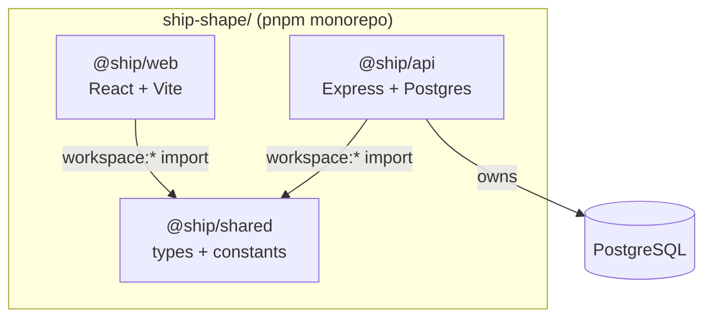

  **Build order** (shared compiles first; both apps depend on its `dist/`):

  - shared must compile first (tsc → dist/). api and web import from that built output.
  - Root scripts enforce this: build:api and build:web both run build:shared first. If shared is not built, the other packages can fail type-checking or at runtime.
  - web adds a Vite bundle step on top of TypeScript; api is TypeScript only.

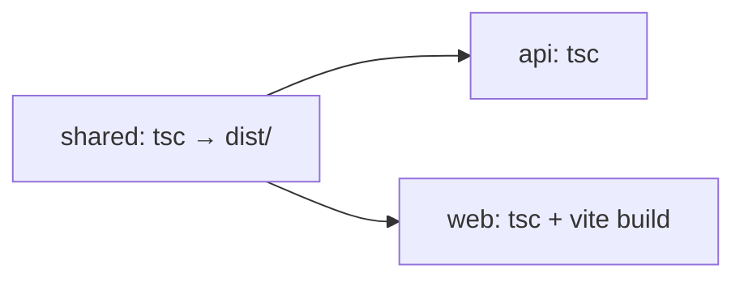

  **Runtime** (separate processes in dev; `web` never imports `api` code):

  - In dev you get two processes: Vite (~5173+) and Express (~3000+).
  - The browser only loads the React app from Vite.
  - Vite proxies API traffic to Express:
    - /api/* — REST (create issue, login, etc.)
    - /collaboration, /events — WebSockets (Yjs collab, live updates)
  - So web and api communicate over HTTP/WebSocket at runtime, not via TypeScript imports.
  - Express then reads/writes Postgres.

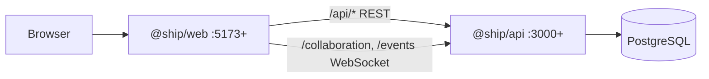

  **What `shared/` is for** (compile-time contract; JSON over the wire is untyped):

  - shared is the compile-time contract between frontend and backend:
    - domain types (document.ts, etc.),
    - constants (HTTP_STATUS, ERROR_CODES, session timeouts), and
    - shared logic like computeICEScore().
  - Both sides import what they need so enums and timeouts stay in sync without duplicating magic numbers.
  - The dashed note matters: not everything uses shared yet.
    - web/src/lib/api.ts still defines its own Workspace / ApiResponse types, and
    - JSON over the wire is not automatically type-checked — shared only helps where you actually import it.

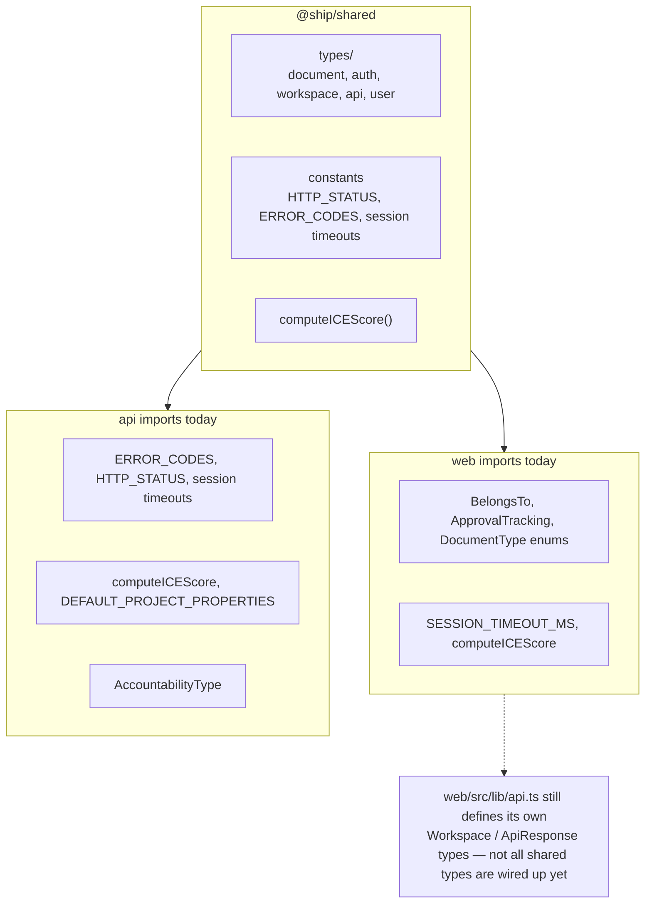

2. Data Model

- Find the database schema (migrations or seed files). Map out the tables and their relationships.
  - **Where to look:** `api/src/db/schema.sql` (greenfield baseline), `api/src/db/migrations/001–037_*.sql` (incremental changes), `api/src/db/migrate.ts` (runs schema + numbered migrations, tracks `schema_migrations`), `api/src/db/seed.ts` (dev data + calls `createAssociation()`).
  - **Two layers:** auth/workspace tables vs. everything-is-a-document content.

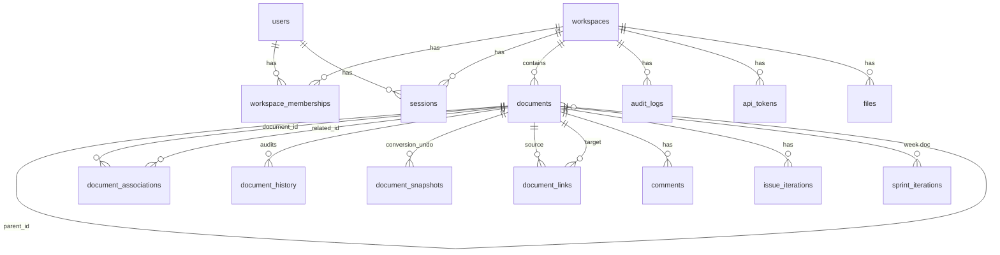

  | Area | Tables |
  |------|--------|
  | Auth & tenancy | `users`, `workspaces`, `workspace_memberships`, `workspace_invites`, `sessions`, `oauth_state`, `api_tokens` |
  | Core content | `documents` (+ Postgres enum `document_type`) |
  | Relationships | `document_associations` (+ enum `relationship_type`), `document_links` |
  | Audit & history | `audit_logs`, `document_history`, `document_snapshots` |
  | Work tracking | `issue_iterations`, `sprint_iterations` (FK → week `documents`) |
  | Other | `files`, `comments` |

- Understand the unified document model: how does one table serve docs, issues, projects, and sprints?
  - **One row = one document.** All content types live in `documents` with shared columns: `title`, TipTap `content` (JSONB), `yjs_state`, `properties` (JSONB), `visibility`, lifecycle timestamps, etc.
  - **Type-specific behavior** comes from `document_type` + shape of `properties` (e.g. issue `state`/`priority`, project ICE scores, person `user_id`).
  - **Hierarchy (product):** Program → Project → Week → Issue (see `docs/ship-philosophy.md`). In DB, week containers still use `document_type = 'sprint'` (historical name); UI says "week."
  - **Week windows vs week docs:** Calendar weeks are *computed* from `workspaces.sprint_start_date` + `properties.sprint_number` — no separate weeks table. A week *document* is created when a program commits to that window (`owner_id`, associations).
  - **Auth ≠ content:** `workspace_memberships` gates access; `documents` where `document_type = 'person'` hold profile content, linked via `properties.user_id` → `users.id`.
  - Legacy `projects` / `sprints` tables were dropped; `schema.sql` ends with `DROP TABLE IF EXISTS projects/sprints`.

- What is the document_type discriminator? How is it used in queries?
  - **Postgres enum** on `documents.document_type` (see `schema.sql` ~line 100): `wiki`, `issue`, `program`, `project`, `sprint`, `person`, `weekly_plan`, `weekly_retro`, `standup`, `weekly_review`.
  - **Mirrored in TypeScript** as `DocumentType` in `shared/src/types/document.ts`.
  - **Almost every route filters on it** — e.g. `WHERE document_type = 'issue'`, `JOIN ... AND s.document_type = 'sprint'`. Prevents treating an issue row as a project in list/detail endpoints.
  - **Partial indexes** use it — e.g. `idx_documents_active` on `(workspace_id, document_type)` where not archived/deleted; `idx_documents_person_user_id` only for `person`.
  - **Zod validation** in API routes uses local enums aligned with (but not always imported from) `shared`.
  - **Renames via migrations** — e.g. `033_sprint_to_week_rename.sql` renamed enum values `sprint_plan` → `weekly_plan`, etc.; the week *container* type stayed `'sprint'`.

- How does the application handle document relationships (linking, parent-child, project membership)?
  - **Three mechanisms** (see `docs/document-model-conventions.md`):

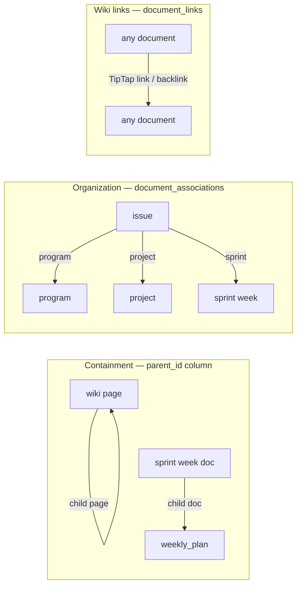

  | Mechanism | Storage | Meaning | Examples |
  |-----------|---------|---------|----------|
  | **parent_id** | Column on `documents` | 1:1 containment; child tied to parent tree; `ON DELETE CASCADE` | Nested wiki pages; `weekly_plan` / `weekly_retro` under week doc (`parent_id = week.id`) |
  | **document_associations** | Junction: `(document_id, related_id, relationship_type)` | Many-to-many *belongs_to*; types: `program`, `project`, `sprint`, `parent` | Issue on a project and assigned to a week; API exposes as `belongs_to[]` |
  | **document_links** | `(source_id, target_id)` | Bidirectional wiki backlinks (editor-maintained) | `@mention`-style links in TipTap content |

  - **API helpers:** `api/src/utils/document-crud.ts` — `getBelongsToAssociations`, `syncBelongsToAssociations`, `addBelongsToAssociation`, etc. Routes should use these instead of ad-hoc SQL.
  - **Create issue flow:** `INSERT` into `documents` with `document_type = 'issue'`, then loop `belongs_to` → `INSERT INTO document_associations` (`issues.ts` ~626–634).
  - **Safety:** `prevent_circular_parent` trigger blocks cyclic `parent_id` chains; associations have `no_self_reference` + unique `(document_id, related_id, relationship_type)`.
  - **Removed:** Legacy columns `program_id`, `project_id`, `sprint_id` on `documents` (migrations 027, 029) — all org relationships go through the junction table now.

3. Request Flow

- Pick one user action (e.g., creating an issue) and trace it from the React component through the API route to the database query and back.
  - **Example: “+ New issue” from a project/week context** (`IssuesList.tsx` → `useCreateIssue` → `POST /api/issues`).

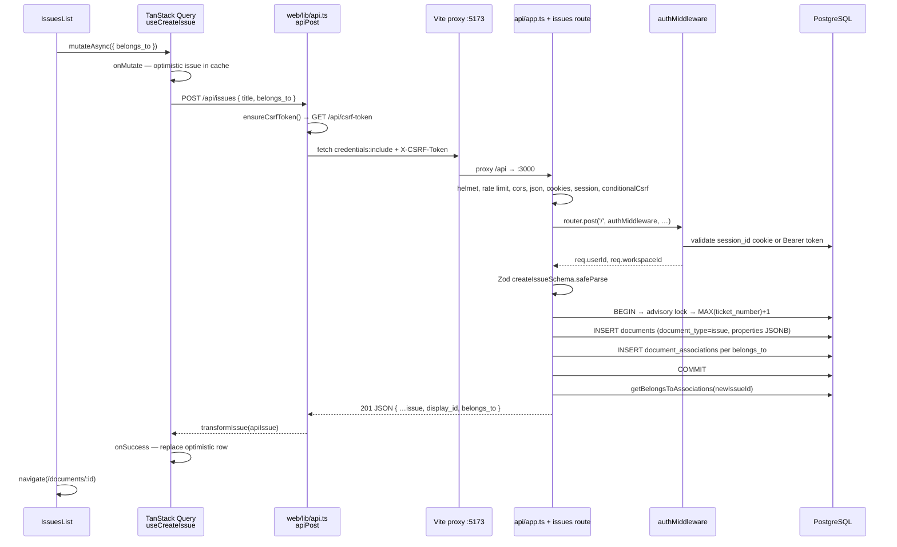

  | Step | File / location | What happens |
  |------|-----------------|--------------|
  | 1 UI click | `web/src/components/IssuesList.tsx` | `handleCreateIssue` builds `belongs_to` from page context (program/project/week), calls `createIssueMutation.mutateAsync` |
  | 2 Hook | `web/src/hooks/useIssuesQuery.ts` | `createIssueApi` → `apiPost('/api/issues', { title, belongs_to })`; mutation adds optimistic issue, rolls back on error |
  | 3 HTTP client | `web/src/lib/api.ts` | Fetches CSRF token, sends cookie `session_id`, `credentials: 'include'` |
  | 4 Proxy | `web/vite.config.ts` | `/api/*` → `http://localhost:${API_PORT}` |
  | 5 Route | `api/src/routes/issues.ts` | `POST /` with `authMiddleware`; Zod validation; transaction with ticket number lock |
  | 6 DB | `documents` + `document_associations` | One issue row + junction rows for org links |
  | 7 Response | Same route | `extractIssueFromRow` + `getBelongsToAssociations` → `201` with `#ticket_number` |

- Identify the middleware chain: what runs before every API request?
  - **Global stack** in `api/src/app.ts` (order matters). Route-specific middleware (e.g. `authMiddleware`) runs **after** this, on each router.

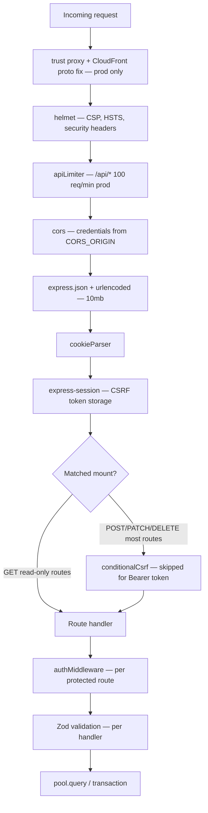

  | Layer | Applies to | Notes |
  |-------|------------|-------|
  | `helmet` | All requests hitting `app` | CSP allows inline for TipTap/admin |
  | `apiLimiter` | `/api/*` | Relaxed in dev/test |
  | `cors` + `credentials: true` | All | Must match web origin |
  | `conditionalCsrf` | Most mutating `/api/*` routes | Session auth only; Bearer API tokens skip CSRF |
  | `loginLimiter` | `POST /api/auth/login` only | 5 failed / 15 min |
  | `authMiddleware` | Per-route on issues, documents, etc. | **Not** global — public routes: `/api/setup`, public feedback, `/health`, `/api/csrf-token`, some GET routers |
  | `visibility` helpers | Document/issue reads | SQL fragment for private docs — used inside handlers, not global |

- How does authentication work? What happens to an unauthenticated request?
  - **Two auth paths** in `api/src/middleware/auth.ts`:

  | Method | Credential | Lookup | Sets on `req` |
  |--------|------------|--------|----------------|
  | Session (browser) | `session_id` httpOnly cookie | `sessions` JOIN `users`; sliding 15 min inactivity + 12 h absolute | `userId`, `workspaceId`, `sessionId`, `isSuperAdmin` |
  | API token (CLI) | `Authorization: Bearer ship_…` | SHA-256 hash → `api_tokens` | `userId`, `workspaceId`, `isApiToken` |

  - **Login** (`POST /api/auth/login`): bcrypt password check → delete old session (fixation) → `INSERT sessions` → `Set-Cookie: session_id` → return user + workspaces.
  - **Frontend gate:** `ProtectedRoute` uses `useAuth` — if no user after load, redirect to `/login` (no API call yet). Once logged in, all `apiGet`/`apiPost` send the cookie.
  - **Session timeouts** (from `@ship/shared`): 15 min idle (`SESSION_TIMEOUT_MS`), 12 h max (`ABSOLUTE_SESSION_TIMEOUT_MS`). Expired → delete session row → `401` + `SESSION_EXPIRED`.
  - **Workspace check:** Non–super-admin must still be in `workspace_memberships` for session’s `workspace_id`; revoked → `403 FORBIDDEN`, session deleted.

  **Unauthenticated request to a protected route:**

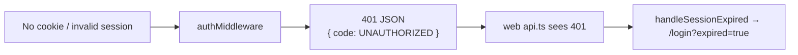

  - Missing cookie: `"No session found"` (`UNAUTHORIZED`) — frontend may redirect without “expired” messaging on first visit.
  - Invalid/expired session: `SESSION_EXPIRED` — login page shows session-expired UX.
  - Invalid Bearer token: `401` `"Invalid or expired API token"` — no redirect (non-browser clients).
  - **Before auth:** request never reaches route handler; no DB writes. Public endpoints (`/health`, `/api/csrf-token`, `/api/setup`, public feedback POST) skip `authMiddleware` by design.

## Phase 2: Deep Dive

4. Real-time Collaboration

- How does the WebSocket connection get established?
  - **Two WebSocket endpoints** on the same HTTP server (`api/src/index.ts` → `setupCollaboration(server)`):

  | Path | Purpose | Client |
  |------|---------|--------|
  | `/collaboration/{room}` | Yjs doc sync + cursors | `Editor.tsx` via `y-websocket` `WebsocketProvider` |
  | `/events` | App notifications (accountability, etc.) | `useRealtimeEvents.tsx` — plain JSON, not Yjs |

  - **Document collab connection flow:**

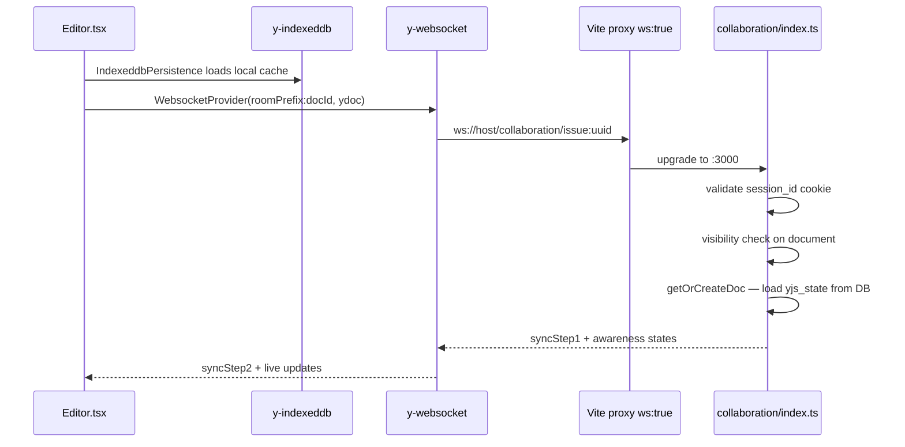

   - **Room name:** `{roomPrefix}:{documentId}` (e.g. `issue:550e8400-…`). Server parses UUID from room string.
   - **Auth:** Same `session_id` cookie as REST — validated in `validateWebSocketSession` before upgrade; no cookie → `401`, no doc access → `403`.
   - **Dev:** `vite.config.ts` proxies `/collaboration` and `/events` with `ws: true` to API port.
   - **Prod:** May use `VITE_WS_URL` to bypass CloudFront (no WebSocket on CDN).

- How does Yjs sync document state between users?
  - **CRDT model:** Each editor has a `Y.Doc` (`useMemo` per `documentId`). TipTap binds via `@tiptap/extension-collaboration` to `ydoc.getXmlFragment('default')`.
  - **Server holds one in-memory `Y.Doc` per room** (`docs` Map in `collaboration/index.ts`). All clients in that room merge into the same doc.
  - **Wire protocol:** `y-protocols/sync` over binary WebSocket frames:
    - `messageSync (0)` — state vector exchange + incremental updates
    - `messageAwareness (1)` — cursor/presence (`CollaborationCursor` extension)
    - `messageClearCache (3)` — server tells client to wipe IndexedDB when doc loaded from JSON
  - **Broadcast:** On `doc.on('update')`, server encodes update and sends to every other connection in the room (sender excluded via `origin`).
  - **Offline layer:** `y-indexeddb` caches Y.Doc locally first (~300ms wait) so navigation feels instant; WebSocket reconciles afterward.

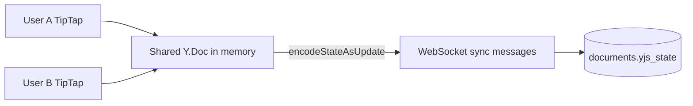

- What happens when two users edit the same document at the same time?
  - **No manual merge locks.** Yjs is a CRDT — concurrent edits become commutative operations; all clients **eventually converge** to the same document state.
  - **Character-level:** Typing in the same paragraph merges safely (standard Yjs text behavior).
  - **Structural edits** (tables, blocks): Also merged by CRDT rules; edge cases are rare but possible with complex structures — E2E `performance.spec.ts` exercises typing under collaboration.
  - **Awareness is separate:** Cursors/selections use the awareness protocol (ephemeral, not persisted to `yjs_state`).
  - **Title/properties:** Not on the Yjs wire for most docs — those use REST (`PATCH` documents/issues) and TanStack Query; only **body content** is real-time via Yjs.
  - **Server is authoritative for persistence:** In-memory doc is source of truth while connections exist; debounced save writes to Postgres. No "last writer wins" — merged state is saved.
  - **Special close codes:** `4403` access revoked, `4100` doc converted, `4101` REST updated content — client clears cache and reconnects or redirects.

- How does the server persist Yjs state?
  - **Column:** `documents.yjs_state` (`BYTEA`) — binary `Y.encodeStateAsUpdate(doc)`.
  - **Debounced:** `schedulePersist` — **2 seconds** after last change (`pendingSaves` map); flushed immediately when last client disconnects.
  - **On persist** (`persistDocument`):
    1. Encode full Yjs update → `yjs_state`
    2. Convert fragment → TipTap JSON via `yjsToJson()` → `content` (fallback for REST reads / search)
    3. Extract `plan`, `success_criteria`, `vision`, `goals` from content → merge into `properties` JSONB
    4. For `weekly_plan` / `weekly_retro`: optional `document_history` row for content (max once/minute)
  - **Load priority** (`getOrCreateDoc`): in-memory cache → `yjs_state` binary → else convert `content` JSON via `jsonToYjs` (once) → empty doc.
  - **Cache invalidation:** REST updates call `invalidateDocumentCache(docId)` — closes WS with `4101`, drops in-memory doc so next connection reloads from DB.
  - **Memory cleanup:** 30s after last disconnect, server drops `Y.Doc` from memory (unless someone reconnects).

5. TypeScript Patterns

- What TypeScript version is the project using?
  - **TypeScript 5.7.2** (`^5.7.2` in root, `api`, `web`, and `shared` package.json files).

- What are the tsconfig.json settings? Is strict mode on?
  - **Yes — `strict: true` everywhere.**
  - **Root** (`tsconfig.json`): `ES2022`, `NodeNext` modules, plus `noUncheckedIndexedAccess`, `noImplicitReturns`, `noFallthroughCasesInSwitch`.
  - **API** extends root → emits to `api/dist`, path alias `@ship/shared` → `shared/dist`.
  - **Web** (`web/tsconfig.json`): `bundler` resolution, `jsx: react-jsx`, `noEmit: true`, path alias `@/*` → `src/*`, project reference to `shared`.

- How are types shared between frontend and backend (the shared/ package)?
  - See **§1** — `@ship/shared` is built first; both apps import types/constants from `shared/dist`.
  - Domain types live in `shared/src/types/` (`document.ts` is the big one).
  - API also uses **Zod** schemas locally for request validation (not always imported from shared).

- Find examples of: generics, discriminated unions, utility types (Partial, Pick, Omit), and type guards in the codebase.
  - **String union types** (discriminator-style): `DocumentType`, `IssueState`, `BelongsToType` in `shared/src/types/document.ts`.
  - **`as const` objects:** `HTTP_STATUS`, `ERROR_CODES` in `shared/src/constants.ts` → literal types via `typeof`.
  - **Type guards:** `isValidRelationshipType(value): value is RelationshipType` in `api/src/routes/associations.ts`; `isBusinessDay`, `isAllowedFile`, etc.
  - **Generics:** `PaginatedResponseSchema<T>` in `api/src/openapi/schemas/common.ts`; Playwright `test.extend<…>` in `e2e/fixtures/isolated-env.ts`.
  - **Utility types:** `Partial<Issue>`, `Partial<Project>` in hooks/pages for PATCH payloads (`useIssuesQuery.ts`, `App.tsx`); `Partial<CAIACredentials>` in secrets service.

- Are there any patterns you do not recognize? Research them.
  - **Worth knowing in this repo (not everyday TS):**
    - **Yjs + CRDT** — collaborative editing wire format (see §4).
    - **Zod + OpenAPI** — runtime validation + schema generation (`@asteasolutions/zod-to-openapi`).
    - **Testcontainers worker fixtures** — per-worker Postgres in Playwright (see §6).
    - **`csrf-sync`** — CSRF token paired with express-session.
    - **`comply` CLI** — Treasury open-source compliance scanner on pre-commit (not TypeScript, but part of dev workflow).

6. Testing Infrastructure

- How are the Playwright tests structured? What fixtures are used?
  - **Location:** `e2e/*.spec.ts` (~71 files, **869 tests** listed via `playwright test --list`).
  - **Config:** `playwright.config.ts` — Chromium only, parallel workers (memory/CPU aware), 60s test timeout, `globalSetup` builds API + web once.
  - **Main fixture:** `e2e/fixtures/isolated-env.ts` — **import `test` from here**, not `@playwright/test` directly.
  - **Per Playwright worker** (isolated, no shared DB):
    - `dbContainer` — Postgres 15 via **testcontainers**
    - `apiServer` — spawned `node api/dist/index.js` on dynamic port
    - `webServer` — `vite preview` (static, **not** `vite dev` — avoids memory blowups)
  - **Helpers:** `e2e/fixtures/test-helpers.ts` (mention popup retries, etc.), `e2e/fixtures/test.pdf` for uploads.
  - **Chromium project only** — no Firefox/WebKit matrix.

- How does the test database get set up and torn down?
  - **Setup (per worker, in fixture):**
    1. Start ephemeral Postgres container (`ship_test` / user `test`).
    2. `runMigrations(dbUrl)` — `schema.sql` + numbered migrations from `api/src/db/migrations/`.
    3. Seed test users/workspace (in fixture — bcrypt passwords, dev-like data).
    4. Point `DATABASE_URL` at container; spawn API.
  - **Teardown:** `finally` blocks — `container.stop()`, `SIGTERM` on API/preview processes.
  - **No shared dev DB** — eliminates cross-test pollution; each worker is independent.

- Run the full test suite. How long does it take? Do all tests pass?
  - **Two commands** (README is misleading — `pnpm test` is **not** E2E):

  | Command | What | Result (May 2026 run) |
  |---------|------|------------------------|
  | `pnpm test` | API **Vitest** unit/integration (`api/src/**/*.test.ts`) | **451 passed** in **~10s** |
  | `pnpm test:e2e` | Playwright E2E (needs **Docker** for testcontainers) | **869 tests** — full run not executed here (typically **tens of minutes** depending on workers/RAM) |

  - **Also:** `pnpm --filter @ship/web test` — Vitest for web unit tests (separate from E2E).
  - **Pre-commit** (`.husky/pre-commit`): empty-test check, API coverage script for new UI routes, optional `comply opensource` scan — **not** full E2E on every commit.

7. Build and Deploy

- Read the Dockerfile. What does the build process produce?
  - **`Dockerfile`** (production API): Node 20 slim image with **pre-built** `shared/dist` + `api/dist` copied in (build happens **before** `docker build`, not inside Dockerfile). Runs `node dist/db/migrate.js` then `node dist/index.js` on **port 80**.
  - **`Dockerfile.dev`**: API dev image (used by `docker-compose.local.yml`).
  - **`Dockerfile.web`**: Web dev image — Vite on 5173.
  - **Frontend prod:** Static `web/dist` → **S3 + CloudFront** (Terraform), not the main `Dockerfile`.

- Read the docker-compose.yml. What services does it start?
  - **`docker-compose.yml`** — **optional** Postgres 16 only (`ship_dev` on port 5432). README says most devs use native Postgres instead.
  - **`docker-compose.local.yml`** (`pnpm docker:up`) — full stack:
    - `postgres` (5433→5432)
    - `api` (3000, migrate on start)
    - `web` (5173, `VITE_API_URL` → api)

- Skim the Terraform configs. What cloud infrastructure does the app expect?
  - **`terraform/environments/{dev,prod,shadow}/`** compose modules:

  | Module | AWS resource |
  |--------|----------------|
  | `vpc` | VPC, subnets, optional NAT |
  | `aurora` | Aurora Serverless v2 PostgreSQL |
  | `elastic-beanstalk` | API backend (Node app) |
  | `cloudfront-s3` | Static web + CDN; proxies API to EB |
  | `security-groups` | ALB, EB, DB rules |
  | `ssm` | Secrets/config (DB URL, domains, etc.) |
  | `waf.tf` | CloudFront WAF (managed rules) |

  - **Gov-style prod pattern:** CloudFront → S3 (web) + EB (API); DB in private subnets; secrets via SSM.

- How does the CI/CD pipeline work (if configured)?
  - **No `.github/workflows` in this repo** — CI is likely **external** (e.g. agency Jenkins/CodeBuild) or manual deploy.
  - **Local quality gates:** Husky pre-commit scripts + `comply` CLI; `CONTRIBUTING.md` mentions “ensure CI checks pass” without defining the remote pipeline.
  - **Typical deploy path (from README/Terraform):** build `shared` + `api` + `web` locally → push API image to EB → upload web assets to S3 → Terraform manages infra; migrations run on API container start.

## Phase 3: Synthesis

8. Architecture Assessment

- What are the 3 strongest architectural decisions in this codebase? Why?
  1. **Unified document model** — One `documents` table + `document_type` + JSONB `properties` instead of separate issue/project/wiki schemas. Fewer joins, one editor/collab path, one migration story. Matches how the product actually works (“everything is a document”).
  2. **Clear split: REST for metadata, Yjs for body** — Lists, auth, associations, ICE, accountability go through Express + TanStack Query; rich text goes through WebSocket CRDTs. Each layer does one job; offline cache (IndexedDB) without pretending the app is fully offline-first.
  3. **Workspace-scoped simplicity** — No per-document ACL matrix. `workspace_memberships` for auth, `person` docs for directory, junction table for org relationships. Easier to reason about and audit (fits gov deployment).

- What are the 3 weakest points? Where would you focus improvement?
  1. **Type contract drift** — `shared/` defines types many places don’t use; `web/src/lib/api.ts` duplicates shapes; Zod enums parallel but don’t always import from shared. **Fix:** wire API responses + Zod to `@ship/shared` (or codegen from OpenAPI).
  2. **Single-process collaboration server** — In-memory `Y.Doc` per room on the API node; sticky sessions implied if you scale EB horizontally. **Fix:** document limits; later Redis/pub-sub or dedicated collab service if multi-instance.
  3. **Docs/tooling gaps** — README vs real dev path (`pnpm dev`, test commands); sprint vs week naming in DB; no in-repo CI definition. **Fix:** README alignment, glossary for `sprint` = week container, visible CI checklist.

- If you had to onboard a new engineer to this codebase, what would you tell them first?
  - **Read in order:** `docs/ship-philosophy.md` (Program → Project → Week → Issue) → `docs/unified-document-model.md` → `docs/document-model-conventions.md` (`parent_id` vs `document_associations`).
  - **Run:** `pnpm install` → `pnpm dev` → login `dev@ship.local` / `admin123` (use terminal URLs, not assumed ports).
  - **Mental model:** Three packages — `web`, `api`, `shared`; they meet via **shared types at build time** and **HTTP/WS at runtime**.
  - **Before changing data:** Trace one flow (e.g. create issue: `IssuesList` → `POST /api/issues` → `documents` + `document_associations`).
  - **Before touching editor:** Collaboration is `api/src/collaboration/index.ts` + `web/src/components/Editor.tsx` — not the REST documents route alone.

- What would break first if this app had 10x more users?
  - **Designed for ~20–200 users** (`application-architecture.md`). At 10× (~2,000), likely pain in this order:
  1. **WebSocket / Yjs memory on API** — One in-memory doc per open room; many simultaneous editors → RAM and CPU on EB instances; collab doesn’t shard across nodes without sticky sessions + redesign.
  2. **Postgres hot paths** — `documents` + `document_associations` + GIN on `properties`; list/filter queries (issues by week/project) without careful indexes or pagination at scale.
  3. **Session + rate limits** — Every request hits `sessions` for sliding timeout; API rate limit is 100 req/min per IP in prod — power users or shared NAT could hit ceilings.
  - **Probably fine longer:** Static web on CloudFront/S3, Aurora Serverless scaling, read-heavy dashboards if cached.
