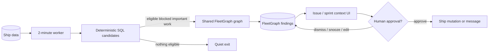
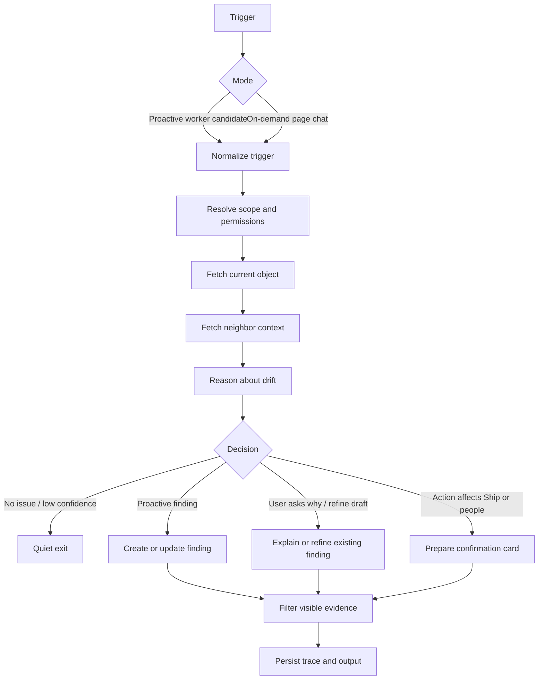
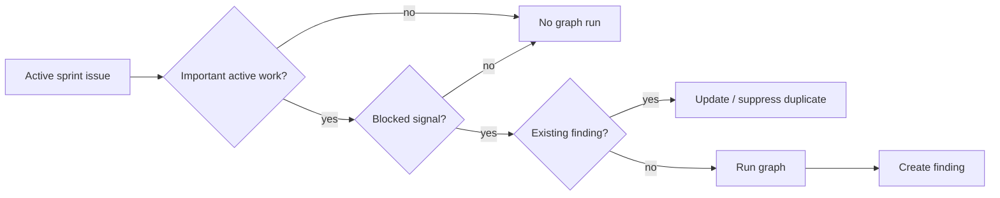
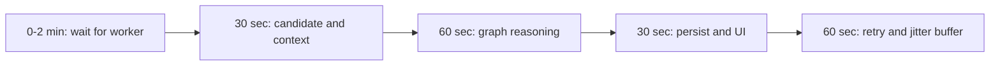
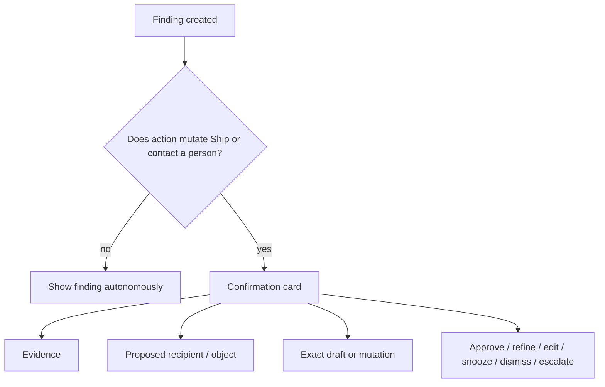
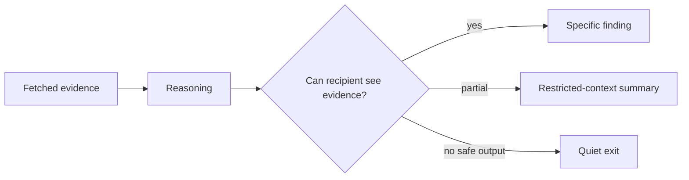
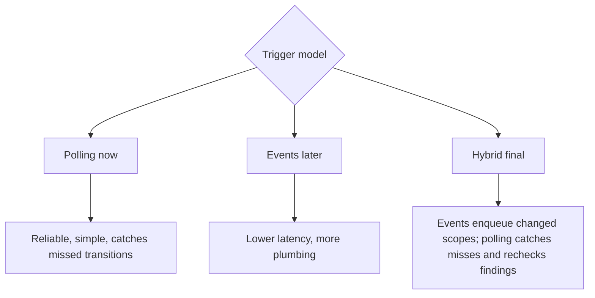

# FleetGraph Architectural Defense

## Opening Claim

FleetGraph is a project drift operator, not a chatbot and not a dashboard.

The MVP proves one hard thing end to end: when Ship state changes without a user present, FleetGraph detects blocked important work inside an active sprint/week, runs a shared graph, creates an action-ready finding within 5 minutes, and stops at a human gate before it mutates Ship or contacts anyone.

That is the smallest slice that proves the assignment's real requirements:

- proactive execution
- same graph for proactive and on-demand modes
- real Ship data
- different graph paths
- human-in-the-loop control
- observable traces
- bounded cost and latency

The finding is not the value. The value is the work FleetGraph does before the human sees it: gather visible evidence, explain why the blocker matters now, identify the smallest useful audience, prepare the next unblock step, and draft the exact message/action.

## System Shape



The key boundary is intentional: Ship remains the source of truth for work. FleetGraph owns diagnosis state.

FleetGraph can autonomously create, update, dedupe, suppress, resolve, and explain findings. It cannot autonomously assign work, move sprint scope, change status, post comments, send messages, or escalate to another person.

## One Graph, Two Entry Points



The trigger differs. The reasoning spine does not.

Proactive mode starts from a deterministic candidate. On-demand mode starts from the user's current page: issue, sprint/week, project, program, or dashboard. Both routes use the same scope resolution, context fetch, permission filtering, drift reasoning, and output logic.

## MVP Detector

The MVP detector is blocked important work inside an active sprint/week.

An issue is eligible only when all are true:

- it belongs to an active sprint/week
- it is explicitly committed, or it is urgent/high priority active sprint work with an owner or assignee
- it is not done
- it has a blocked signal
- no open FleetGraph finding already covers the same dedupe key

If Ship has no explicit commitment marker, FleetGraph does not pretend high priority is commitment. It describes the fallback honestly as high-priority active sprint work.

The LLM does not decide what to scan. SQL chooses candidates first. The graph only runs after deterministic filters produce a bounded candidate.



This is narrow on purpose. The assignment rewards a working proactive graph with traces, UI, human gate, deployment, and latency. More detectors are expansion paths after the first detector works.

## Latency Defense

Requirement: surface the problem within 5 minutes.

MVP timing budget:



The worker ticks every 2 minutes. Empty ticks are cheap SQL and produce no LLM cost. Eligible candidates run the graph and persist visible findings.

## Human Gate



This is the safety model:

- FleetGraph gathers evidence, chooses the smallest useful audience, drafts the next action, and can refine that draft in context.
- Humans approve consequences.
- Ship stays canonical.

## Permission Model

FleetGraph may reason server-side over permitted Ship data, but user-facing output is filtered to the recipient's visibility.



The agent must not leak hidden document titles, private excerpts, restricted project names, or inferred confidential facts through a summary. Every user-visible claim must be backed by evidence visible to that user.

## Why Polling For MVP

Polling is the correct MVP choice because it is the shortest reliable path to deployed proactive behavior.



Webhooks or internal events are the better long-term trigger for fresh changes. They also require event definitions, replay, idempotency, failure recovery, and more integration work. For the architecture defense, the defensible answer is: polling proves the proactive requirement now; hybrid is the target architecture.

## Cost Defense

Cost is candidate-driven, not project-driven.

```text
daily graph runs = new eligible candidates + due rechecks + on-demand invocations
```

The cost cliff is not the 2-minute worker. The cost cliff is broad reasoning over whole workspaces, repeated duplicate processing, and broad on-demand chat that expands beyond the current object without scope control.

Mitigations:

- deterministic SQL eligibility before graph execution
- dedupe keys
- finding status and recheck metadata
- cooldowns
- bounded context fetches
- permission-filtered output
- scope narrowing for broad on-demand prompts

At 100 projects, cheap polling is fine if most ticks produce zero graph runs. At 1,000 projects, FleetGraph needs budgets, severity ranking, concurrency caps, cooldowns, and event-backed candidate selection. At 10,000 users, on-demand usage likely dominates proactive cost.

## Failure Modes

If Ship reads fail, FleetGraph does not create new claims from stale or partial data. It records the failed run, retries later, and leaves existing findings visible with stale-run metadata.

If multiple API instances run the worker, FleetGraph needs a DB lease. Without a lease, duplicate workers can create duplicate findings, duplicate traces, and unnecessary graph cost. MVP assumes one deployed API worker; the DB lease is the required production hardening step.

If evidence is restricted, FleetGraph emits a restricted summary or exits quietly.

## Expected Reviewer Pushback

**Why not webhooks immediately?**

Hybrid is the right final architecture. Polling is the right MVP architecture because it is reliable, deployable fast, catches missed state transitions, and meets the 5-minute requirement with a 2-minute tick.

**Why only one detector?**

Because the hard part is not inventing drift types. The hard part is proving proactive execution, shared graph routing, real data, observability, UI output, human gating, and latency. One sharp detector proves the system if it does real PM work: evidence gathering, audience selection, unblock planning, draft preparation, and in-context refinement. More detectors reuse it.

**What makes this a graph instead of a pipeline?**

The graph branches by mode, eligibility, intent, permission visibility, confidence, action risk, dedupe state, and resolved-vs-open condition. The proactive trace and on-demand trace should take visibly different paths.

**What can FleetGraph do without approval?**

It can maintain FleetGraph-owned findings and draft recommended actions. It cannot change Ship's source of truth or contact people without confirmation.

**How does on-demand mode use page context?**

It starts from the object the user is viewing and expands outward through linked issues, sprint/week state, project/program associations, owners, recent activity, existing findings, and visible documents. It can explain the finding, draft the next action, or refine the draft with human-provided context.

## Defense Script

Lead with this:

> We are not building a general project assistant. We are building a proactive drift operator. The MVP proves the hard part: Ship state changes without a user present, FleetGraph detects blocked important active sprint work through deterministic candidate selection, runs the shared graph, creates an action-ready finding within 5 minutes, drafts the unblock path, and stops at a human gate before changing Ship or contacting anyone.

Then defend three decisions:

1. Narrow detector first, but action-ready output.
2. Polling MVP, hybrid future.
3. FleetGraph findings and draft refinement are autonomous; Ship mutations and communications require confirmation.

## Direction If Time

The architecture is built to become a project risk ledger and drift autopilot, but the week-five promise stays the action-ready blocked-work loop.

The best stretch is draft refinement inside the confirmation card. The user should be able to say "make this softer," "add that Legal is the dependency," "rewrite this for the director," or "I disagree; frame this as a scope tradeoff." FleetGraph revises the prepared action in context without sending it, posting it, or forcing the user to copy text into another AI tool.

The next stretch is a finding timeline: "flagged because," "changed since," "still blocked because," and "needs you because." That keeps the human oriented while FleetGraph does more of the context-gathering work.

After that, the same graph can add detectors for carryover risk, silent owners, orphaned high-priority work, missing execution context, and repeated program-level drift. These are not separate assistants. They are new inputs into the same risk ledger and human-gated action system.

## Conclusion

This architecture is intentionally small where breadth would create risk, and strict where autonomy would be unsafe.

The system proves the assignment with one real proactive loop:

Ship state changes -> deterministic candidate -> shared graph -> action-ready finding -> permission-filtered output -> human gate.

That is the core product. Everything else is an expansion of detector coverage.
