# FleetGraph Architectural Defense - Abridged

## What We Are Building

FleetGraph is an agent inside Ship that notices project drift before a human asks.

It is not a chatbot.
It is not another dashboard.
It is not trying to manage the whole project by itself.

It watches Ship, finds a real problem, explains it, and prepares the next action.

For MVP, it does one thing well:

> Find blocked committed work inside the active sprint/week and surface it within 5 minutes.

## The Basic Idea

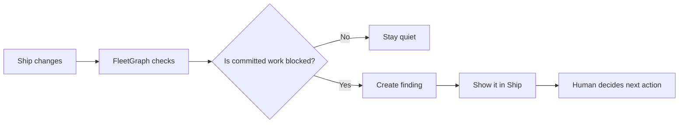


FleetGraph should stay quiet unless it can answer three questions:

1. What is wrong?
2. Why does it matter now?
3. What should happen next?

## The MVP

The MVP detector is:

> A committed issue in an active sprint/week is blocked.

That is the first signal because it is concrete, useful, and easy to verify against real Ship data.

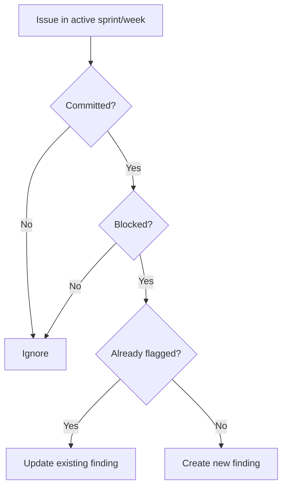


We are choosing one sharp detector first because the hard part is not imagining many possible alerts.

The hard part is proving the full loop works:

Ship data changes -> FleetGraph notices -> graph runs -> finding appears -> human controls the action.

## Two Modes, One Graph

FleetGraph has two ways to start:

- **Proactive:** FleetGraph runs by itself and pushes a finding.
- **On-demand:** A user opens FleetGraph from a page and asks a question.

But both modes use the same graph.

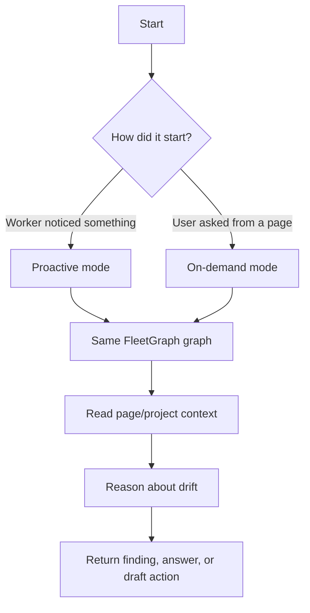


The trigger changes.
The reasoning system stays the same.

## What FleetGraph Can Do Alone

FleetGraph can safely manage its own findings.

It can:

- read Ship data
- detect blocked committed work
- create a FleetGraph finding
- update a finding
- suppress duplicates
- resolve a finding when the problem goes away
- draft a suggested next action

## What Requires Human Approval

FleetGraph must ask before it changes Ship or contacts people.

It cannot automatically:

- assign work
- change issue status
- move work between sprints/weeks
- change priority
- post a comment
- send a message
- escalate to a director

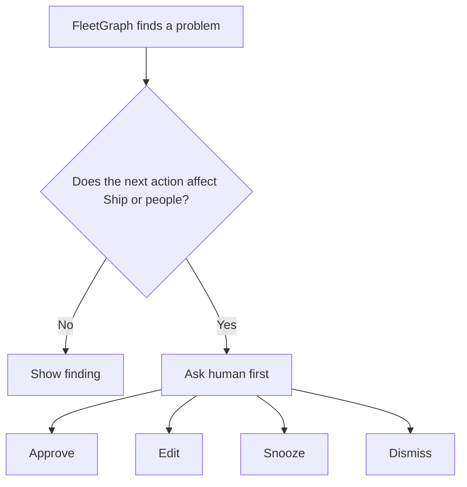


The rule is simple:

> FleetGraph can diagnose. Humans approve consequences.

## Where The Finding Appears

FleetGraph should appear where the work already lives.

For MVP, that means the issue page and sprint/week context.

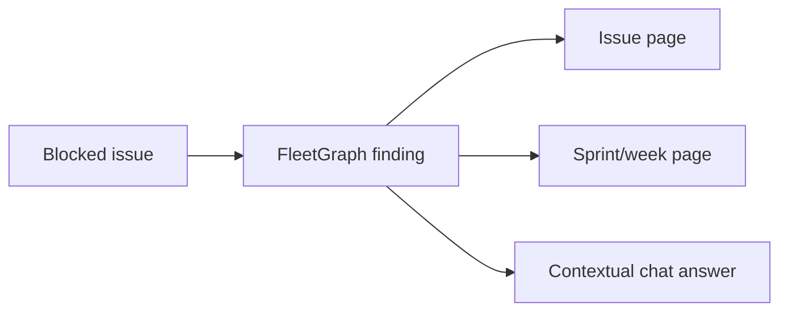


The chat is not the product.

The finding is the product.

Chat is how a user asks follow-up questions like:

- Why was this flagged?
- What changed?
- Who should handle this?
- Draft the unblock message.

## Why Polling

For MVP, FleetGraph checks Ship every 2 minutes.

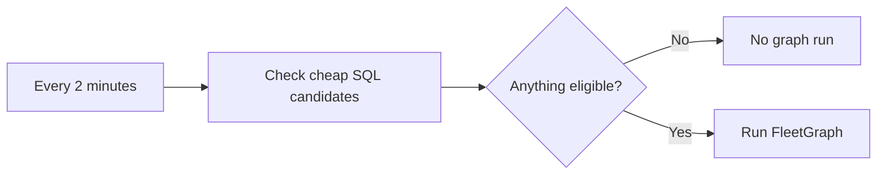


Polling is good enough for MVP because:

- it is simple
- it is reliable
- it catches missed changes
- it meets the 5-minute requirement
- empty checks are cheap

Long term, the best design is hybrid:

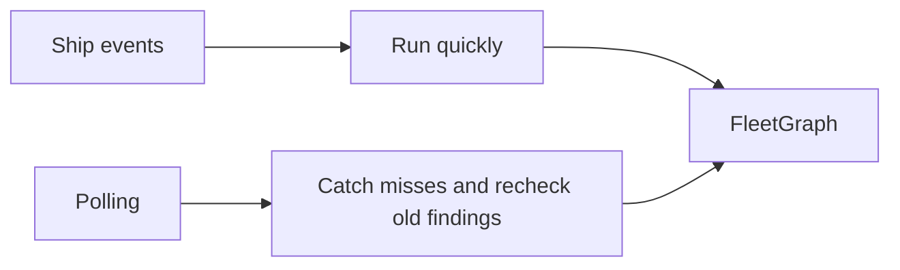


Events make it faster.
Polling makes it safer.
MVP starts with polling.

## The 5-Minute Promise

FleetGraph must surface the problem within 5 minutes.

Our budget:

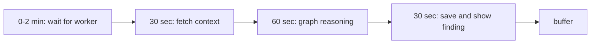


The important point:

> The graph does not run every 2 minutes on everything. It only runs when cheap deterministic checks find a real candidate.

## Why This Is Not Too Expensive

Cost depends on graph runs, not project count.

```text
cost = eligible findings + rechecks + user questions
```

FleetGraph avoids waste by:

- checking candidates with SQL first
- not using the LLM on empty ticks
- deduping repeated findings
- limiting context
- rechecking open findings on a schedule

The expensive mistake would be asking the model to scan the whole workspace.

We are not doing that.

## What Makes It A Graph

FleetGraph makes different decisions depending on the situation.

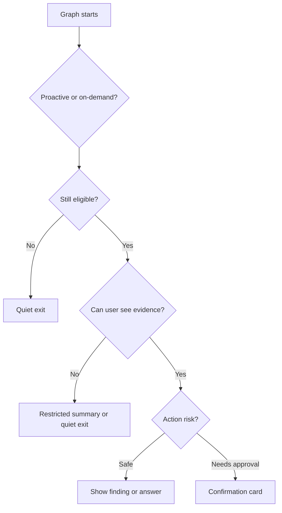


This is not a straight pipeline.

The graph can:

- create a finding
- update a finding
- explain a finding
- draft an action
- ask for approval
- stay quiet

## The Safety Boundary

Ship owns work.
FleetGraph owns findings.

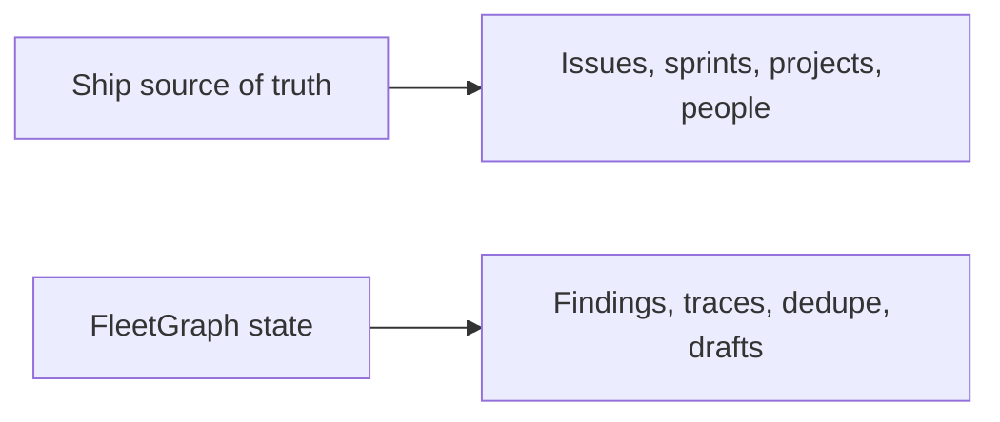


FleetGraph does not silently rewrite the team's work.

It points out drift and prepares action.
The human stays in control.

## How To Explain It In One Minute

FleetGraph is a proactive project drift agent for Ship.

For MVP, it watches active sprint/week work and finds committed issues that are blocked.

It checks cheaply every 2 minutes. If nothing is wrong, it stays quiet. If something qualifies, it runs the shared graph, gathers context, creates a finding, and shows it where the work lives.

The same graph also powers on-demand chat from the current page, so a user can ask why something was flagged or ask for a draft next action.

FleetGraph can manage its own findings, but it cannot change Ship or contact people without human approval.

That gives us the core loop:

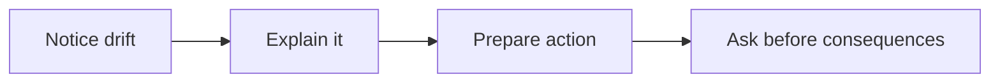


## The Short Defense

We are intentionally starting narrow.

One detector is enough to prove the architecture:

- proactive worker
- deterministic candidate selection
- shared graph
- real Ship data
- contextual UI
- human approval gate
- traceable execution
- 5-minute latency

After that works, more detectors are just more candidate rules and graph branches.

The product idea is simple:

> Ship shows what is happening. FleetGraph notices what is drifting and helps the team take the next safe action.

