# FleetGraph Architecture

Week 5 architecture for **FleetGraph**: a proactive project drift operator inside Ship—not a chatbot, not a dashboard. Ship remains the source of truth for work; FleetGraph owns diagnosis state (findings, drafts, traces) and stops at a human gate before mutating Ship or contacting anyone.

**Related docs:** [FLEETGRAPH.md](./FLEETGRAPH.md) (submission spec), [ARCHITECTURAL_DEFENSE.md](./ARCHITECTURAL_DEFENSE.md) (defense script), [PRESEARCH.md](./PRESEARCH.md) (checklist answers).

---

## 1. Positioning

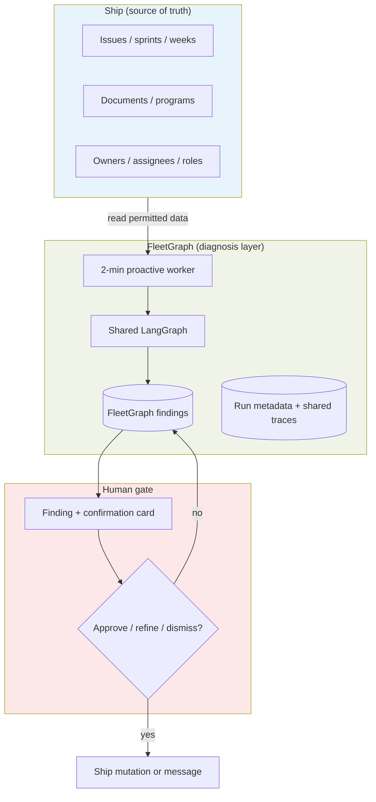

| Layer | Owns | Does not own |
| --- | --- | --- |
| **Ship** | Issues, status, sprint/week, documents, associations, canonical work state | Drift reasoning, draft messages, finding lifecycle |
| **FleetGraph** | Findings, evidence snapshots, dedupe, traces, draft actions | Autonomous assign/status/comment/notify without confirmation |
| **Human** | Consequences: send, escalate, re-scope, accept risk | Clerical evidence gathering FleetGraph already did |

**Week 5 promise:** one detector end-to-end—**blocked important work in an active sprint/week**—with action-ready output within **5 minutes**, **two distinct trace paths** (proactive vs on-demand), and **embedded contextual chat**.

---

## 2. Two modes, one graph

Assignment requirement: proactive (event-driven) and on-demand (user chat) must share **one graph**; routing differs by trigger, not by duplicate pipelines.

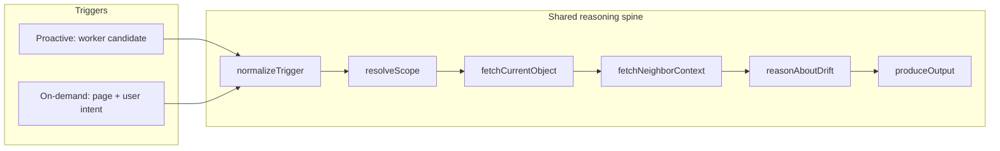

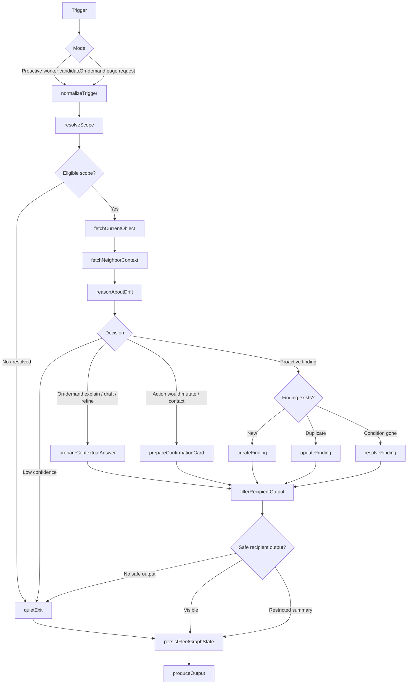

**Branching that must show up in traces (not a pipeline):**

| Branch | Proactive example | On-demand example |
| --- | --- | --- |
| Mode | Candidate from SQL | User on issue page asks "why flagged?" |
| Eligibility | Still blocked in active sprint | Explains existing finding |
| Intent | `create_finding` | `explain` or draft refine |
| Dedupe | Update vs new vs quiet | N/A or refine draft only |
| Action risk | Autonomous finding only | `needs_confirmation` for Ship/contact |
| Permission | Filter evidence for recipient | Same filter on answer |

---

## 3. System context

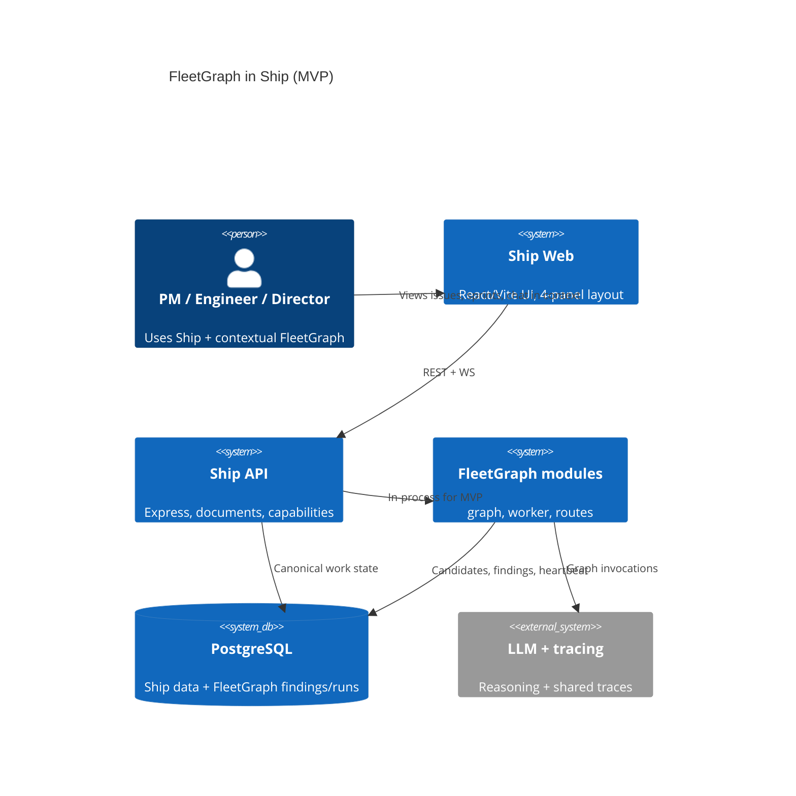

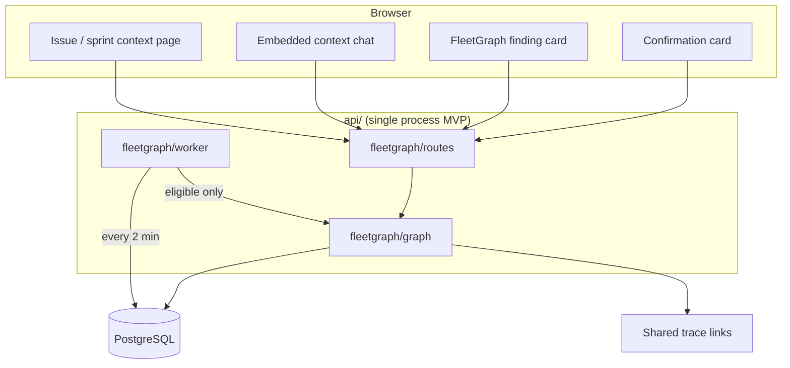

**Module boundaries (extractable later):**

- `fleetgraph/graph` — shared nodes and conditional edges
- `fleetgraph/worker` — polling loop, SQL candidates, rechecks
- `fleetgraph/routes` — on-demand endpoint, finding CRUD, trace metadata

---

## 4. Proactive workflow (MVP)

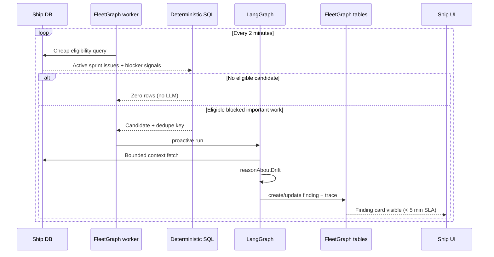

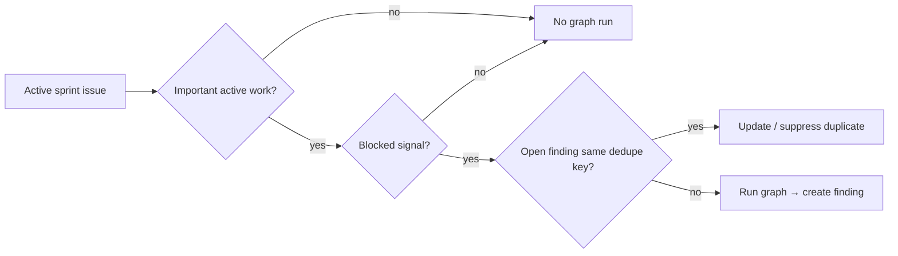

**MVP eligibility (all must be true):**

1. Issue in an **active sprint/week**
2. **Important active work:** explicit commitment marker in Ship, *or* conservative fallback: not done, owner/assignee, `priority in ('urgent','high')` — described honestly as "urgent/high active sprint work," not "committed"
3. **Blocked signal:** recent blocker text in `issue_iterations.blockers_encountered`
4. **No open finding** for the same dedupe key

The LLM does **not** choose what to scan. SQL bounds cost and latency before any model call.

---

## 5. On-demand workflow (embedded context)

Chat is a **power feature** on the page the user is viewing—not a standalone chatbot route.

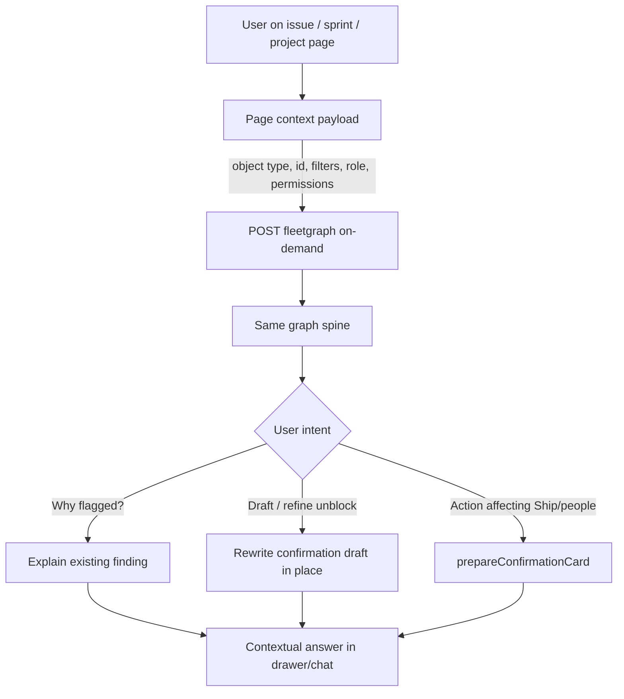

```mermaid
sequenceDiagram
  participant U as User
  participant Page as Issue page UI
  participant API as fleetgraph/routes
  participant G as LangGraph
  participant F as Existing finding

  U->>Page: Opens blocked issue (sees finding card)
  U->>Page: "Why was this flagged?"
  Page->>API: context + message
  API->>G: on_demand / explain
  G->>F: Load finding + fresh Ship reads
  G-->>Page: Explanation + evidence (no Ship mutation)
  U->>Page: "Make it softer; Legal is the dependency"
  Page->>API: refine intent
  API->>G: on_demand / draft refine
  G-->>Page: Updated draft on confirmation card
```

**Scope resolution:** start at anchor object (issue, sprint/week, project, program, dashboard), expand to linked issues, associations, owners, recent activity, open findings, visible documents—never whole-workspace reasoning by default.

---

## 6. Human-in-the-loop

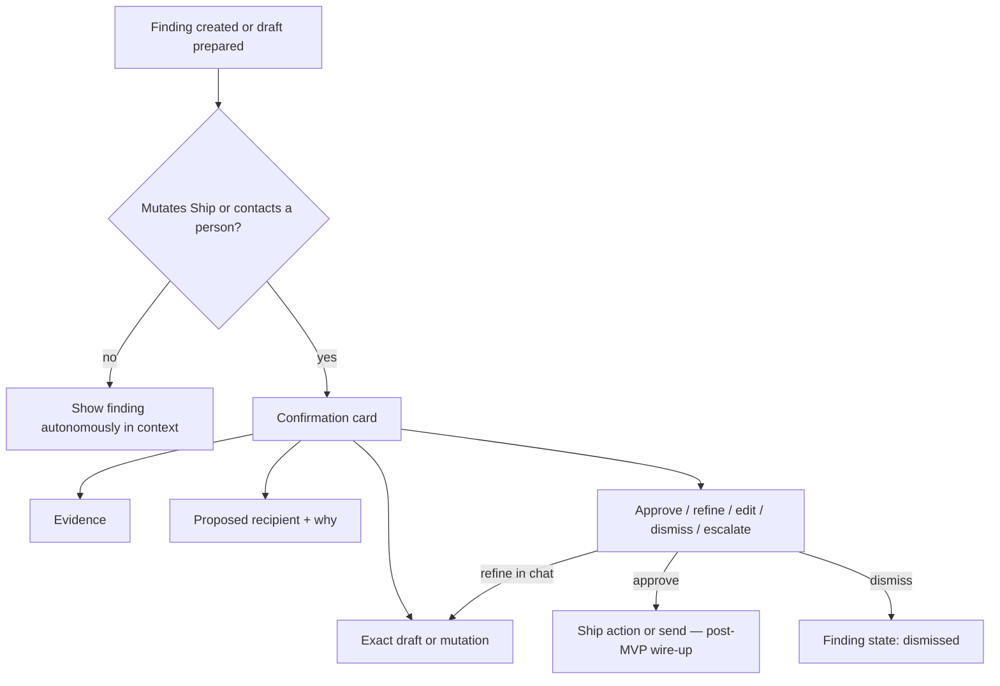

| Autonomous (no confirmation) | Requires confirmation |
| --- | --- |
| Create/update/dedupe/resolve FleetGraph findings | Assign / reassign |
| Evidence gathering, severity, routing reasoning | Status, priority, sprint/week, due date |
| Show in-app finding + draft text | Document edits, new work items |
| Persist traces and run metadata | Comments, notifications, escalation |
| Draft recommended next action | Accept risk on behalf of team |

**UX principle (advisor):** automate clerical work but keep humans oriented—finding shows *flagged because*, *needs you because*, and optional timeline (*changed since*) so users are not surprised by silent automation.

---

## 7. Permission and evidence

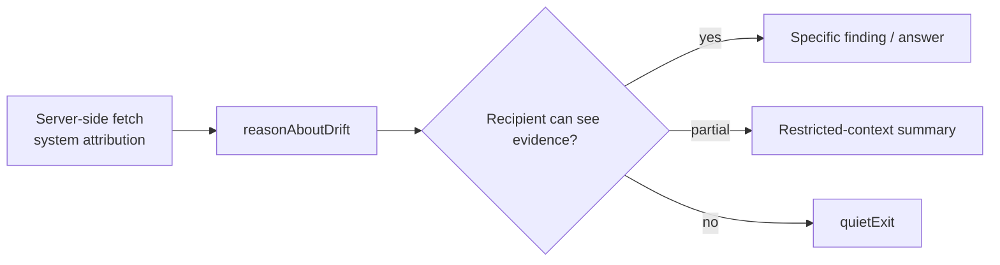

- Proactive detection may use server-side reads; **every user-visible claim** must cite evidence visible to that recipient.
- No leaking hidden document titles, private excerpts, restricted project names, or inferred confidential facts.
- Incomplete project graph → lower confidence + explicit "missing relationship" wording.

**Audience routing (smallest useful audience):**

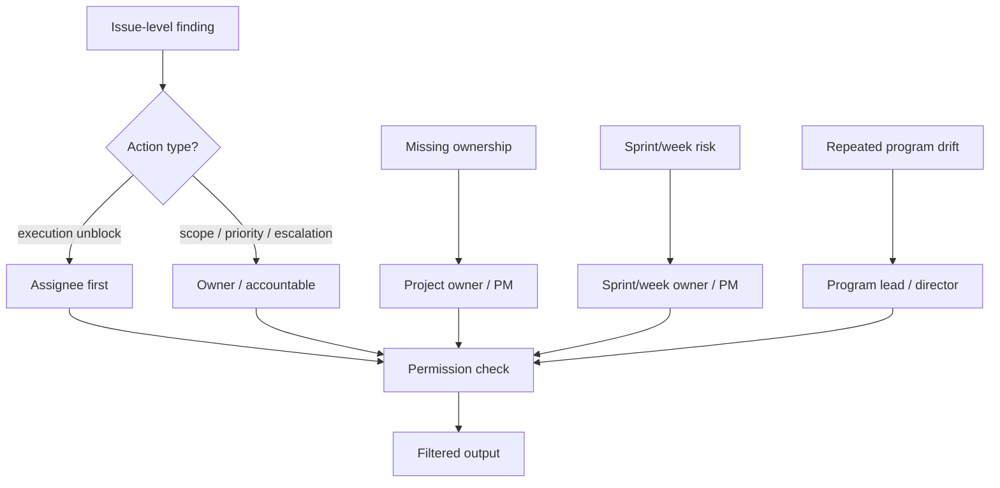

---

## 8. State and data boundaries

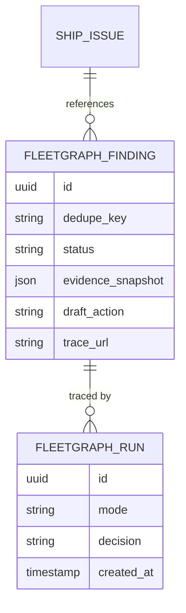

| State | Lifetime | Contents |
| --- | --- | --- |
| **Graph run state** | Single invocation | Mode, trigger, scope IDs, permissions, summaries, decision, trace ID |
| **Persistent FleetGraph** | Cross-run | Findings, dedupe keys, snooze/dismiss, watermarks, heartbeat, recheck times |
| **Ship** | Canonical | Issues, documents, associations—refetched when accuracy matters |

**Deduping and cost control:**

```text
daily graph runs = new eligible candidates + due rechecks + on-demand invocations
```

Empty poll ticks = SQL only, **zero LLM tokens**.

---

## 9. Trigger model: MVP → target

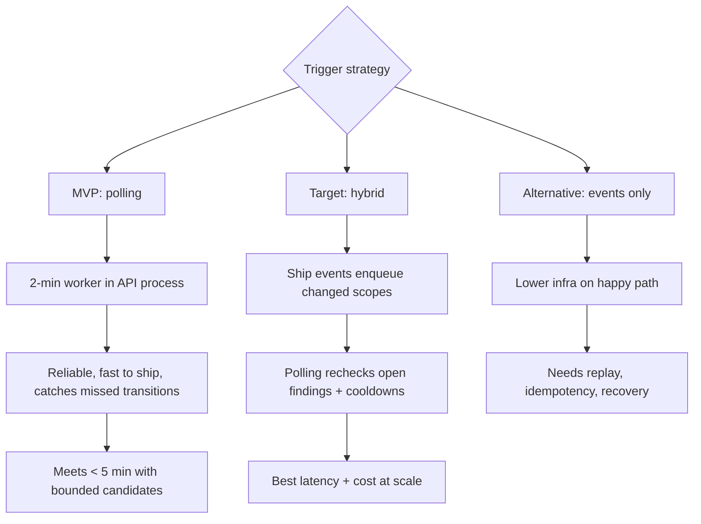

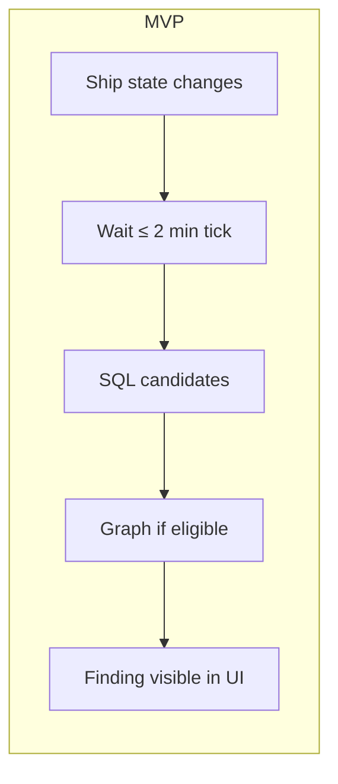

**Latency budget (< 5 min detection):**

```mermaid
gantt
  title Proactive SLA budget (minutes)
  dateFormat X
  axisFormat %M min

  section Wait
  Worker tick (max)     :0, 2
  section Work
  Candidate + context   :2, 2.5
  Graph reasoning       :2.5, 3.5
  Persist + UI          :3.5, 4
  section Buffer
  Retry / jitter        :4, 5
```

| Segment | Budget |
| --- | --- |
| Wait for next poll | ≤ 120 s |
| SQL + bounded fetch | ≤ 30 s |
| Graph + trace | ≤ 60 s |
| Persist + UI | ≤ 30 s |
| Buffer | ≤ 60 s |

---

## 10. Deployment and reliability

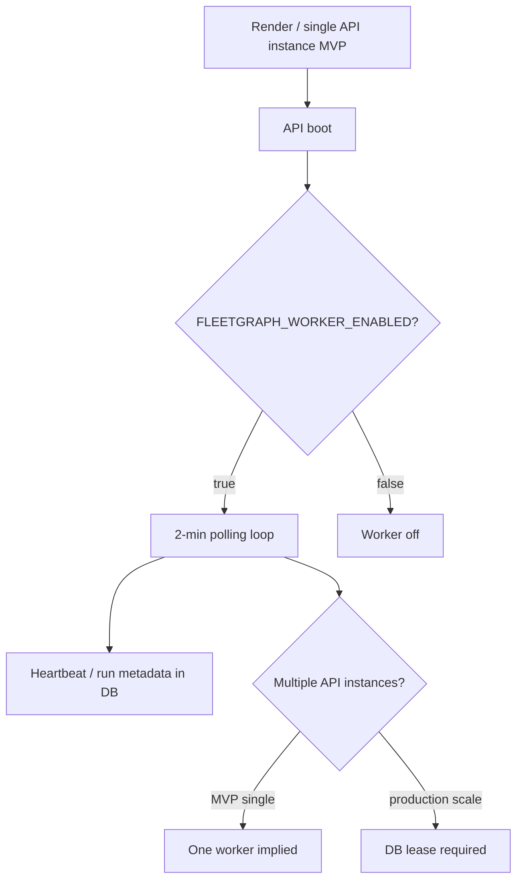

| Failure | Behavior |
| --- | --- |
| Ship read fails | No new claims from stale data; record failed run; retry next tick; existing findings show stale metadata |
| Graph / LLM fails | No new NL claims; simple deterministic finding maintenance only if safe |
| Duplicate workers (no lease) | Risk duplicate findings/traces—**DB lease required** when horizontally scaled |
| Tracing fails | Run incomplete—not valid submission evidence |
| Restricted evidence | Restricted summary or quiet exit |

**Authentication:** server-side system attribution for MVP; long-term scoped service principal. Confirmed mutations record **both** FleetGraph and approving user.

---

## 11. UI architecture (embedded context)

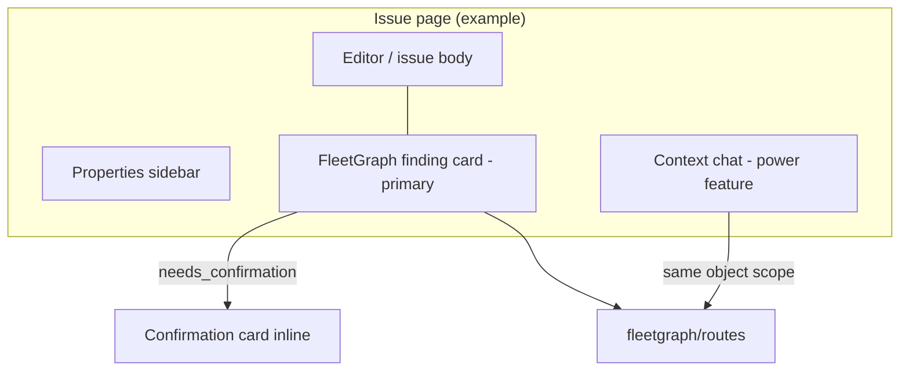

**Interaction priority:**

1. **Proactive finding card** — visible without typing; shows why flagged, evidence, recommended next step, draft.
2. **Confirmation card** — human gate for consequences; supports in-place draft refinement.
3. **Embedded chat** — explain, refine, follow-up; must receive page context (type, id, visible state, role).

No global standalone FleetGraph page in MVP.

---

## 12. Observability (required traces)

LangGraph plus reviewer-shareable tracing from day one. LangSmith is acceptable, but the advisor clarification allows any tracing tool that provides links. Submissions must include **shared trace links** showing **different paths**, not one identical run.

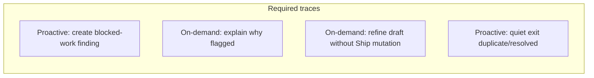

Each run persists: `mode`, trigger reason, source object, `decision`, finding ID, trace URL.

---

## 13. Use case map (MVP vs expansion)

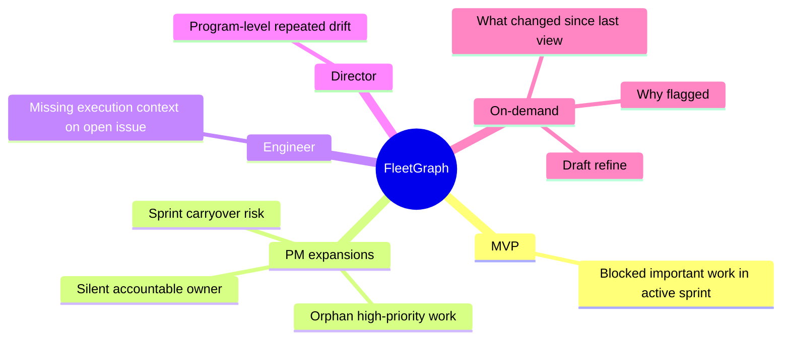

| # | Role | Trigger | MVP? |
| --- | --- | --- | --- |
| 1 | PM | Blocked important work in active sprint | **Yes — E2E** |
| 2 | PM | Sprint end + blocked work still open | Expansion |
| 3 | Engineer | Opens assigned blocked issue | On-demand explain |
| 4 | Director | Repeated blocked-work pattern | Expansion |
| 5 | PM/Director | "Why was this flagged?" | On-demand trace |

---

## 14. Cost architecture

```mermaid
flowchart TD
  Cliff[Cost cliffs] --> C1[Full-workspace LLM scans]
  Cliff --> C2[Noisy candidates / no dedupe]
  Cliff --> C3[Oversized context payloads]
  Cliff --> C4[Broad on-demand prompts]

  Mitigate[Mitigations] --> M1[SQL before LLM]
  Mitigate --> M2[Dedupe + cooldown + recheck schedule]
  Mitigate --> M3[Bounded parallel fetches]
  Mitigate --> M4[Permission-filtered summaries]
  Mitigate --> M5[Scope narrowing for chat]
```

| Scale | Directional risk |
| --- | --- |
| ~100 users | Affordable if ticks usually empty and rechecks cooled down |
| ~1,000 users | Needs budgets, severity ranking, concurrency caps |
| ~10,000 users | On-demand invocations likely dominate proactive cost |

**Token target per proactive finding:** ~2k–4k input, ~500–1k output (summarized context, not raw workspace dumps).

---

## 15. Week 5 delivery timeline

```mermaid
timeline
  title FleetGraph deadlines
  section Defense
    Architecture defense : 4h after assignment
  section Build
    MVP : Tuesday 11:59 PM
    Early submission : Thursday 11:59 PM
    Final submission : Sunday noon
```

**MVP checklist (architecture view):**

- [ ] One proactive detector wired E2E (blocked important active sprint work)
- [ ] Shared graph; distinct proactive vs on-demand trace paths
- [ ] Human confirmation gate before Ship mutation / contact
- [ ] Context-embedded chat on issue/sprint views
- [ ] Real Ship data; worker in API; findings in DB + UI
- [ ] Deployed + trace links documented in FLEETGRAPH.md

---

## 16. Architecture decision summary

| Decision | Choice | Rationale |
| --- | --- | --- |
| Agent role | Project drift operator | Does PM clerical work before human sees it |
| Graph framework | LangGraph + shared tracing | Required traces; conditional branches |
| Trigger MVP | 2-min polling in API | Reliable, < 5 min SLA, no event bus yet |
| Trigger target | Hybrid events + polling | Fresh enqueue + recheck/safety net |
| Detectors MVP | One: blocked important sprint work | Proves proactive loop; reuse graph for more |
| Candidate selection | Deterministic SQL first | Cost, latency, no LLM scanning |
| Findings store | FleetGraph-owned tables | Ship stays canonical |
| Deployment | In-process API modules | One-week scope; clean extract later |
| Chat | Embedded page context | Assignment + advisor requirement |
| Safety | Human gate on mutations/contact | Automation without losing user context |

---

## 17. End-to-end reference (single diagram)

```mermaid
flowchart TB
  subgraph Triggers
    Poll[2-min worker]
    Chat[On-demand chat]
  end

  subgraph Select
    SQL[SQL eligibility + dedupe]
  end

  subgraph Graph["Shared LangGraph"]
    N[normalizeTrigger] --> S[resolveScope]
    S --> F[fetch + filter evidence]
    F --> R[reasonAboutDrift]
    R --> X{branch}
  end

  subgraph Outputs
    Find[(Finding)]
    Quiet[quietExit]
    Ans[Contextual answer]
    Card[Confirmation card]
  end

  subgraph Gate
    Human{Human approves?}
    ShipWrite[Ship mutation / message]
  end

  Poll --> SQL
  SQL -->|eligible| N
  SQL -->|none| Quiet
  Chat --> N
  X -->|proactive| Find
  X -->|explain/refine| Ans
  X -->|low conf / dup resolved| Quiet
  X -->|risky action| Card
  Find --> UI[In-context UI]
  Ans --> UI
  Card --> Human
  Human -->|yes| ShipWrite
  Human -->|no| Find
```

This is the architecture Week 5 defends and ships: **Ship changes → deterministic candidate → shared graph → action-ready finding → permission-filtered UI → human gate for consequences.**
