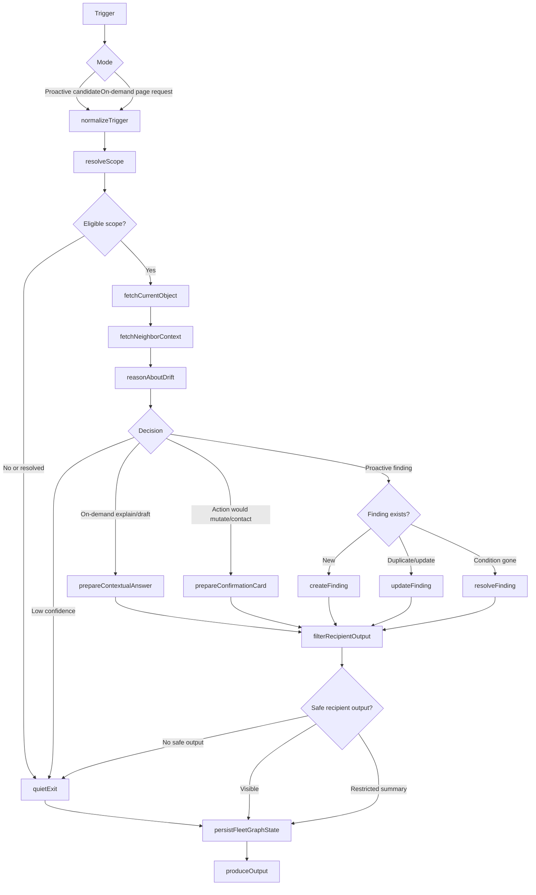

# FleetGraph

FleetGraph is a proactive project drift operator for Ship. It watches deterministic Ship state for execution drift, runs a shared LangGraph for proactive and on-demand reasoning, persists its own findings autonomously, and asks humans before it mutates Ship's source of truth or contacts people.

## MVP Scope

The MVP proves one detector end to end: blocked committed work inside an active sprint/week.

A Ship issue becomes a proactive FleetGraph candidate when all conditions are true:

1. The issue belongs to an active sprint/week.
2. The issue is committed work. MVP uses the narrowest existing commitment marker in Ship. If Ship has no explicit commitment marker, the fallback is intentionally conservative: active sprint/week membership, not-done status, an owner or assignee, and `priority in ('high', 'critical')`. High priority alone is not treated as commitment.
3. The issue has a blocked signal: blocked status, blocked label, or recent blocker language in issue/update text.
4. No open FleetGraph finding already covers the same dedupe key.

The LLM does not decide which issues are worth checking. SQL-level deterministic candidate selection bounds the graph before model reasoning runs.

## Agent Responsibility

FleetGraph monitors Ship for execution drift that changes the next useful action for a PM, engineer, or director. For MVP, it monitors blocked committed issues in active sprint/weeks and creates contextual findings within the product.

FleetGraph may autonomously:

- Read permitted Ship data from the server-side API process.
- Run deterministic candidate checks.
- Invoke the shared LangGraph for eligible candidates.
- Create, update, dedupe, suppress, and resolve FleetGraph-owned findings.
- Persist run metadata, decision metadata, and LangSmith trace links.
- Draft recommended next actions and unblock messages.

FleetGraph must ask a human before:

- Assigning or reassigning work.
- Changing issue status, priority, sprint/week, due date, or owner.
- Editing documents or canonical Ship work records.
- Posting comments, sending notifications, or escalating to another person.
- Accepting project risk on behalf of a team.

FleetGraph derives project membership from Ship's graph: issue assignees, owners, project/program associations, sprint/week ownership, document associations, recent contributors, workspace roles, PMs, leads, supervisors, admins, and directors. It routes findings to the smallest useful audience and filters evidence to avoid leaking restricted context.

The MVP notification surface is an in-product FleetGraph finding card on the affected issue and sprint/week context. External comments, messages, and escalations are drafted but not sent without confirmation.

On-demand mode starts from the current page context: object type, object ID, visible state, user role, and permissions. It uses the same graph core as proactive mode but is read/explain/draft only for MVP. Proactive mode owns finding creation and updates.

## Graph Diagram

Key branches:

- Proactive vs. on-demand trigger.
- Candidate still eligible vs. resolved or low confidence.
- On-demand explanation vs. drafted action vs. proactive finding.
- New finding vs. duplicate/update.
- Autonomous FleetGraph state update vs. human approval required for Ship mutation or communication.
- Recipient-visible evidence vs. restricted summary vs. quiet exit.

## Use Cases

| # | Role | Trigger | Agent Detects / Produces | Human Decides |
| --- | --- | --- | --- | --- |
| 1 | PM | Active sprint/week contains a committed high-priority issue with a blocked signal | Blocked-work finding, owner/assignee, sprint/project context, evidence, severity, confidence, draft unblock message | Send/edit message, escalate, re-scope, dismiss |
| 2 | PM | Active sprint/week nears end with blocked committed work still open | Carryover risk explanation tied to the blocked issue and sprint/week | Re-scope, defer, notify owner, accept risk |
| 3 | Engineer | Engineer opens an assigned blocked issue | Contextual explanation of why it was flagged, linked context, likely next unblock step | Ask PM, update issue, request clarification |
| 4 | Director | Program/project view contains repeated blocked-work findings | Pattern summary across affected work, owners, and projects | Request recovery plan, intervene, dismiss |
| 5 | PM/Director | User asks "why was this flagged?" from an issue or sprint/week page | On-demand explanation using the existing finding and current visible context | Follow up, approve a drafted action, dismiss |

MVP implements use case 1 end to end. The others reuse the same graph shape and are expansion paths after the first detector is working.

## Trigger Model

MVP uses server-side polling inside the existing API process.

- The FleetGraph worker starts with the API process when `FLEETGRAPH_WORKER_ENABLED=true`.
- It ticks every 2 minutes.
- Each tick runs deterministic SQL candidate checks for blocked committed work in active sprint/weeks.
- Eligible candidates enter the shared LangGraph.
- Findings must become visible within 5 minutes of the blocked signal appearing in Ship.

Latency budget for the timed test:

- Up to 120 seconds waiting for the next poll tick.
- Up to 30 seconds for candidate query and bounded context fetch.
- Up to 60 seconds for graph reasoning and trace recording.
- Up to 30 seconds to persist the finding and make it visible in the UI.
- 60 seconds reserved for jitter, retries, or cold-path overhead.

Polling is the right MVP tradeoff because it is reliable, fast to deploy, and catches missed transitions without building an event bus. The long-term architecture is hybrid: Ship events enqueue changed scopes immediately, while polling rechecks open findings, catches missed events, and handles cooldowns.

Cost is candidate-driven, not project-driven:

`daily graph runs = new eligible candidates + due rechecks + on-demand invocations`

Cheap polling can run often. LLM reasoning only runs after deterministic filters produce a bounded candidate.

## Human-in-the-Loop

FleetGraph owns diagnosis state. Ship owns canonical work state.

For MVP, a blocked-work finding includes:

- Title and summary.
- Source issue and sprint/week.
- Evidence snapshot.
- Severity and confidence.
- Recommended next action.
- Draft unblock message/action.
- LangSmith trace link.

FleetGraph may display this finding without approval. It may not send the draft, post a comment, assign work, change status, move sprint/week scope, or escalate without explicit human confirmation.

The MVP human gate is a confirmation card for the drafted unblock action. The card shows the evidence, affected issue/sprint, proposed recipient, exact draft text, and the blocked action. If sending/posting is not implemented in MVP, the gate still records `needs_confirmation` and prevents accidental mutation or communication.

Humans may dismiss findings. FleetGraph may resolve findings when the source condition disappears, but it does not autonomously dismiss a human-visible finding as if a person rejected it. `snooze` is nice-to-have, not required for the architecture defense.

Recipient output is permission-filtered after reasoning. FleetGraph may reason server-side with system attribution, but user-facing output may not reveal restricted document titles, hidden project names, private text excerpts, or inferred confidential facts. If the useful evidence is restricted, the output becomes a restricted-context summary or quiet exit.

## Observability

FleetGraph uses LangGraph and LangSmith from day one.

Each graph run records:

- Mode: `proactive` or `on_demand`.
- Trigger reason.
- Source object type and ID.
- Decision: `quiet_exit`, `create_finding`, `update_finding`, `explain`, `draft_action`, or `needs_confirmation`.
- Finding ID when applicable.
- LangSmith trace ID or URL.

Required trace evidence:

1. Proactive blocked committed issue creates a finding.
2. On-demand "why was this flagged?" explains that finding from a contextual page.
3. Optional: proactive run exits quietly because the candidate resolved or is a duplicate.

Trace debug UI is nice-to-have, not MVP. MVP persists trace metadata and includes submitted trace links in this file or submission notes.

## Deployment Model

FleetGraph runs inside the existing backend API process for MVP.

This avoids an extra service boundary, deployment target, auth path, and operational surface during the one-week sprint. The implementation should still keep clean internal boundaries:

- `fleetgraph/graph`: shared LangGraph nodes and edges.
- `fleetgraph/worker`: 2-minute polling loop and candidate selection.
- `fleetgraph/routes`: contextual on-demand endpoint and finding endpoints.

The worker uses heartbeat/run metadata in the database. MVP assumes a single deployed API worker. If deployment runs multiple API instances, a DB lease becomes required for correctness, not polish: without it, duplicate workers can create duplicate findings, duplicate traces, and unnecessary graph cost.

FleetGraph authenticates server-side using an explicit system attribution path. Long term, this becomes a scoped service principal. The safety rule is unchanged: service-principal access may detect drift, but recipient-facing output must be permission-filtered and cannot leak restricted evidence.

If Ship reads fail, FleetGraph does not create new claims from stale or partial data. It records the failed run, retries on the next tick, and leaves existing findings visible with stale-run metadata. On-demand mode reports the missing context instead of answering from old state.

## Test Cases

| # | Ship State | Expected Output | Trace Link |
| --- | --- | --- | --- |
| 1 | Active sprint/week contains committed high/critical issue with blocked signal and no existing finding | Proactive graph creates blocked-work finding within 5 minutes | To be added |
| 2 | User asks why the flagged issue was flagged from the issue/sprint context | On-demand graph explains the existing finding and drafts next action without mutating Ship | To be added |
| 3 | Candidate issue already has an open finding with the same dedupe key | Proactive graph updates or suppresses duplicate finding | Nice-to-have |
| 4 | Blocked signal is removed before recheck | Proactive graph resolves or quietly exits | Nice-to-have |
| 5 | Evidence is not visible to current user | Graph returns restricted-context output or quiet exit | Nice-to-have |

## Architecture Decisions

- Use LangGraph for the shared graph and LangSmith for traces.
- Run inside the API process for MVP, with clean module boundaries for later extraction.
- Use deterministic SQL candidate selection before LLM reasoning.
- Persist FleetGraph-owned findings rather than mutating Ship work records.
- Make proactive mode responsible for findings; on-demand mode explains and drafts only.
- Implement contextual UI first. A global FleetGraph panel is not MVP.
- Persist trace metadata. A reviewer/debug trace UI is nice-to-have.
- Use heartbeat/run metadata first. DB lease is not MVP for a single deployed worker, but is required if production runs multiple API instances.

## Cost Analysis

Final cost analysis will be completed after implementation records real invocation counts and token usage.

Initial assumptions:

- Polling ticks: every 2 minutes, 720 ticks/day.
- LLM cost on empty ticks: zero.
- Normal proactive finding target: 2,000-4,000 input tokens and 500-1,000 output tokens.
- Heavier rollups are not part of MVP.
- Main cost cliffs: broad workspace reasoning, noisy candidate generation, repeated duplicate processing, oversized context, and broad on-demand prompts.

Working formula:

`monthly cost = (proactive graph runs + rechecks + on-demand runs) * average model cost per run`

Provisional scale assumptions until real usage data exists:

| Scale | Assumption | Directional risk |
| --- | --- | --- |
| 100 users | Tens of proactive runs/day plus light on-demand use | Affordable if duplicate rechecks are cooled down |
| 1,000 users | Hundreds of graph runs/day unless event-backed filtering is added | Needs budgets, cooldowns, and severity ranking |
| 10,000 users | On-demand use likely dominates proactive detection cost | Needs scope narrowing and summarized context before reasoning |

The most dangerous cost assumption is not polling. It is broad on-demand prompts that expand from one page into whole-workspace reasoning.

Mitigations:

- Deterministic candidate filters.
- Dedupe keys.
- Finding status and recheck metadata.
- Severity ranking.
- Bounded context fetches.
- Permission-filtered evidence.
- Scope narrowing for broad on-demand requests.

## Non-MVP / Later

- Hybrid event + polling trigger model.
- Global FleetGraph panel.
- Trace/debug reviewer UI.
- Snooze support.
- DB lease for multiple API instances.
- External notifications/comments after approval.
- Additional detectors: orphaned high-priority work, missing owner, sprint carryover risk, silent accountable owner, program-level repeated drift.
